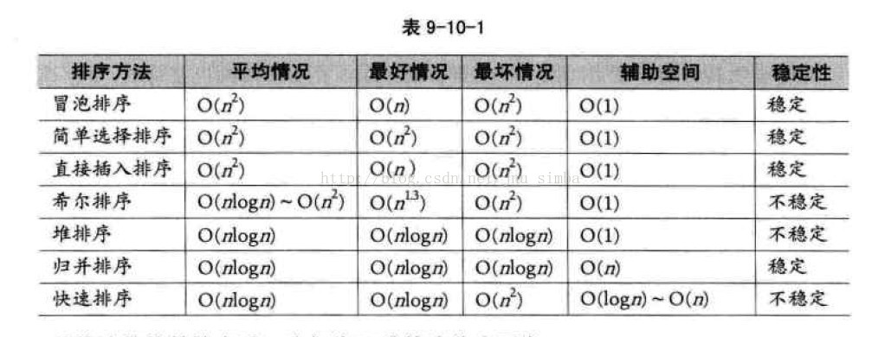

# Frontend Interview keypoints

<p align="center">   &nbsp &nbsp &nbsp &nbsp &nbsp
</p>

## 算法和数据结构

### 1. 知道的排序算法 说一下冒泡快排的原理

冒泡排序：重复地走访过要排序的元素列，依次比较两个相邻的元素，如果他们的顺序（如从大到小、首字母从A到Z）错误就把他们交换过来。走访元素的工作是重复地进行直到没有相邻元素需要交换，也就是说该元素已经排序完成。

快速排序：通过一趟排序将要排序的数据分割成独立的两部分，其中一部分的所有数据都比另外一部分的所有数据都要小，然后再按此方法对这两部分数据分别进行快速排序，整个排序过程可以递归进行，以此达到整个数据变成有序序列。

### 2. Heap排序方法的原理？复杂度？

堆排序（英语：Heapsort）是指利用堆这种数据结构所设计的一种排序算法。堆是一个近似完全二叉树的结构，并同时满足堆积的性质：即子结点的键值或索引总是小于（或者大于）它的父节点。

复杂度：O (nlgn)

### 3. 几种常见的排序算法，手写

基本排序算法：冒泡，选择，插入，希尔，归并，快排

**冒泡排序**

```js
function bubbleSort(data){
var temp=0;
for(var i=data.length;i>0;i--){
for(var j=0;j<i-1;j++){
if(data[j]>data[j+1])
{
temp=data[j];
data[j]=data[j+1];
data[j+1]=temp;
}
}
}
return data;
}
```

**选择排序**

```js
function selectionSort(data){
for(var i=0;i<data.length;i++){
var min=data[i];
var temp;
var index=1;
for(var j=i+1;j<data.length;j++){
if(data[j]<min)
{
temp=data[j];
data[j]=min;
min=temp;
}
}
temp=data[i];
data[i]=min;
data[index]=temp
}
}
```

**插入排序**

```js
function insertSort(data){
var len=data.length;
for(var i=0;i<len;i++){
var key=data[i];
var j=i-1;
while(j>=0&&data[j]>key){
data[j+1]=data[i];
j--;
}
data[j+1]=key;
}
return data;
}

```

**希尔排序**

```js
function shallSort(array) {
var increment = array.length;
var i

var temp; //暂存

do {

//设置增量
increment = Math.floor(increment / 3) + 1;
for (i = increment ; i < array.length; i++) {
if ( array[i] < array[i - increment]) {
temp = array[i];
for (var j = i - increment; j >= 0 && temp < array[j]; j -= increment) {
array[j + increment] = array[j];
}
array[j + increment] = temp;
}
}
}
while (increment > 1)
return array;
}

```

**归并排序**

```js
function mergeSort ( array ) {
var len = array.length;
if( len < 2 ){
return array;
}
var middle = Math.floor(len / 2),
left = array.slice(0, middle),
right = array.slice(middle);
return merge(mergeSort(left), mergeSort(right));
}
function merge(left, right)
{
var result = [];
while (left.length && right.length) {
if (left[0] <= right[0]) {
result.push(left.shift());
} else {
result.push(right.shift());
}
}
while (left.length)
result.push(left.shift());
while (right.length)
result.push(right.shift());
return result;
}
```

**快速排序**

```js
function quickSort(arr){
if(arr.length==0)
return [];
var left=[];
var right=[];
var pivot=arr[0];
for(var i=0;i<arr.length;i++){
if(arr[i]<pivot){
left.push(arr[i]);
}
else{
right.push(arr[i]);
}
}
return quickSort(left).concat(pivot,quickSort(right));
}
```

<p align="center"></p>

### 4. 数组的去重，尽可能写出多个方法

(一）最简单的双层循环方法：

```js
var array = ['1','2',1,'1','4','9','1'];
function unique(array){
var res=[];
for(var i=0,arraylen=array.length;i<array.length;i++){
for(var j=0,reslen=array.length;j<array.length;j++){
if(array[i]==res[j])
break;
}
if(j===reslen)
{
res.push(array[i])
}
}
return res;
}
console.log(unique(array));

```

(二）用indexOf简化内层循环：indexOf函数返回某个指定的字符在字符串中第一次出现的位置

```js
var array = ['1','2',1,'1','4','9','1'];
function unique(array){
var res=[];
for(var i=0,len=array.length;i<len;i++){
var current=array[i];
if(res.indexOf(current)===-1)
{
res.push(current);
}
}
return res;
}
console.log(unique(array));
```

(三）排序后去重

```js
var array = ['1','2',1,'1','4','9','1'];
function unique(array) {

// res用来存储结果
var res=[];
var sortArray = array.concat().sort();
console.log(sortArray);
var seen;
for(var i=0,len=sortArray.length;i<len;i++){
if(!i||seen!==sortArray[i]){
res.push(sortArray[i]);
}
seen=sortArray[i];
}
return res;
}
console.log(unique(array)); //
```

(四）ES6的方法，使用set和map数据结构，以set为例，它类似于数组，但是成员的值都是唯一的，没有重复的值，很适合这个题目

```js
var array = ['1','2',1,'1','4','4','1'];
function unique(array) {

// res用来存储结果
return Array.from(new Set(array));
}
console.log(unique(array));

```

### 5. 如果有一个大的数组，都是整型，怎么找出最大的前10个数

排序数组，输出前10个

### 6. 知道数据结构里面的常见的数据结构

常见的数据结构有链表，栈，队列，树，更深一点的就还有图

### 7. 找出数组中第k大的数组出现多少次，比如数组【1，2，4，4，3，5】第二大的数字是4，出现两次，所以返回2

对数组进行排序，找到第k大的数，然后看第k大的数有几个，返回

### 8. 合并两个有序数组

即是采用归并排序即可

### 9. 给一个数，去一个已经排好序的数组中寻找这个数的位置（通过快速查找，二分查找）

```js
function binarySearch(target,arr,start,end) {
var start   = start || 0;
var end     = end || arr.length-1;
var mid = parseInt(start+(end-start)/2);
if(target==arr[mid]){
return mid;
}else if(target>arr[mid]){
return binarySearch(target,arr,mid+1,end);
}else{
return binarySearch(target,arr,start,mid-1);
}
return -1;
```

### 10. 把多维数组变成一维数组的方法

法一：递归

```js
function flatten(arr) {
var result = [];
for (var i = 0, len = arr.length; i < len; i++) {
if (Array.isArray(arr[i])) {
result = result.concat(flatten(arr[i]))
}
else {
result.push(arr[i])
}
}
return result;
}
```

法二：toString

```js
function flatten(arr) {
return arr.toString().split(',').map(function(item){
return +item
})
}
```

法三：reduce

```js
function flatten(arr) {
return arr.reduce(function(prev, next){
return prev.concat(Array.isArray(next) ? flatten(next) : next)
}, [])
}
```
法四：rest运算符

```js
function flatten(arr) {
while (arr.some(item => Array.isArray(item))) {
arr = [].concat(...arr);
}
return arr;
}
```

### 11.尾递归

如果一个函数中所有递归形式的调用都出现在函数的末尾，我们称这个递归函数是尾递归的。当递归调用是整个函数体中最后执行的语句且它的返回值不属于表达式的一部分时，这个递归调用就是尾递归。


### 12. 如何写一个大数阶乘？递归的方法会出现什么问题？

递归方法会有计算溢出的问题

```js
function factorial(n){
return n > 1 ? n * factorial(n-1) : 1;
}
```

### 13. 二叉树层序遍历

思路：先建立一棵二叉树。再进行队列遍历

```js
function tree(obj) {
var obj = obj.split(')');
obj.pop();
var newobj = [];
for (var i = 0; i < obj.length; i++) {
newobj.push(obj[i].replace('(',''));
}
var root = {
value: null, left: null, right: null,have:0
}
var u;
for(var i = 0; i < newobj.length; i++) {
var a1 = newobj[i].split(',')[0];
var a2 = newobj[i].split(',')[1];
u = root;
if(a2!==''){
for (var j = 0;j<a2.length;j++) {
if(a2[j]==='L'){
if(u.left === null){
u.left = newnode();
u = u.left;
}else {
u = u.left;
}
} else if(a2[j]==='R') {
if(u.right === null){
u.right = newnode();
u = u.right;
}else{
u = u.right;
}
}
}
if(u.have === 1)  {
} else{
u.value = a1;
u.have = 1;
}
}else {
root.value = a1;
u.have = 1;
}
}
return root;
}
```

```js
//建立新结点
function newnode() {
return {value: null, left: null, right: null,have:0};
}
```

```js
//队列遍历
function bfs() {
var root = tree('(11,LL)(7,LLL)(8,R)(5,)(4,L)(13,RL)(2,LLR)(1,RRR)(4,RR)');
var front = 0,rear = 1,n=0;
var q = [],ans=[];
q[0] = root;
while(front < rear) {
var u = q[front++];
if(u.have!==1) {
return;
}
ans[n++] = u.value;
if(u.left!==null) {
q[rear++] = u.left;
}
if(u.right!==null) {
q[rear++] = u.right;
}
}
console.log(ans.join(' '));
}
bfs();
```

### 14. B树的特性，B树和B+树的区别

一个m 阶的B树满足以下条件：

每个结点至多拥有m棵子树；

根结点至少拥有两颗子树（存在子树的情况下）；

除了根结点以外，其余每个分支结点至少拥有m/2 棵子树；

所有的叶结点都在同一层上；

有k 棵子树的分支结点则存在 k-1 个关键码，关键码按照递增次序进行排列；

关键字数量需要满足ceil(m/2)-1 <= n <= m-1；

B树和B+树的区别：

以一个m阶树为例。

关键字的数量不同；B+树中分支结点有m个关键字，其叶子结点也有m个，其关键字只是起到了一个索引的作用，但是B树虽然也有m个子结点，但是其只拥有m-1个关键字。

存储的位置不同；B+树中的数据都存储在叶子结点上，也就是其所有叶子结点的数据组合起来就是完整的数据，但是B树的数据存储在每一个结点中，并不仅仅存储在叶子结点上。

分支结点的构造不同；B+树的分支结点仅仅存储着关键字信息和儿子的指针（这里的指针指的是磁盘块的偏移量），也就是说内部结点仅仅包含着索引信息。

查询不同；B树在找到具体的数值以后，则结束，而B+树则需要通过索引找到叶子结点中的数据才结束，也就是说B+树的搜索过程中走了一条从根结点到叶子结点的路径。


