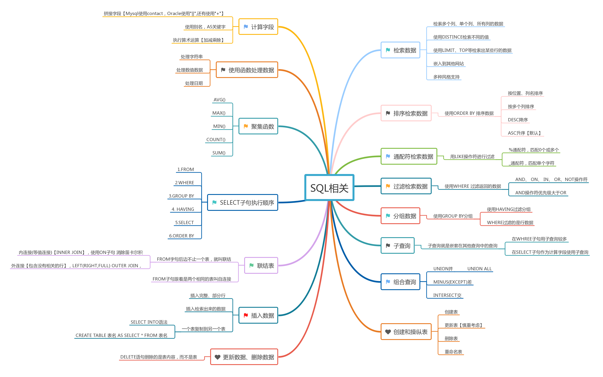
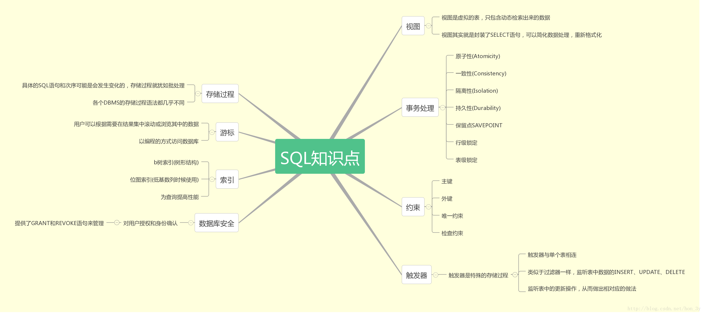
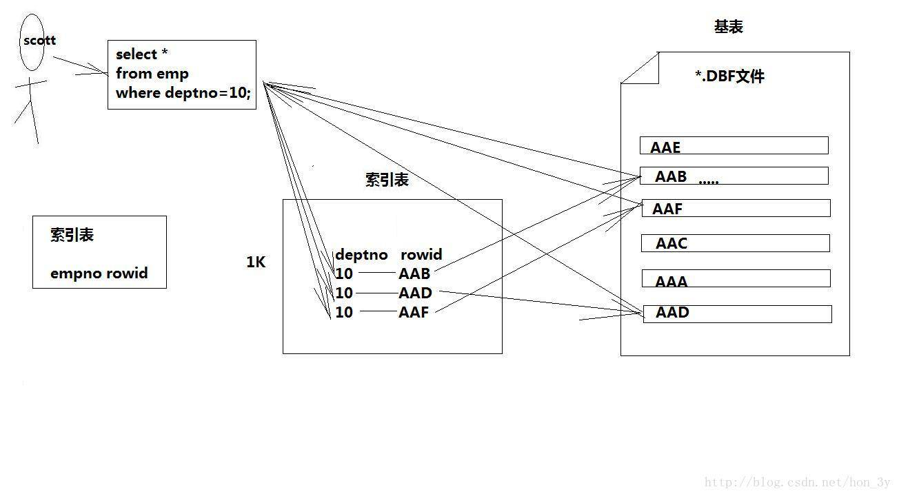
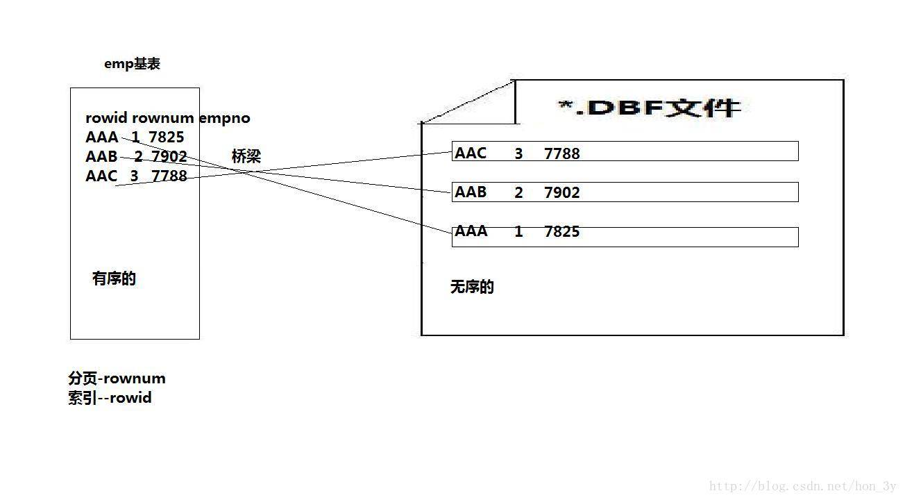
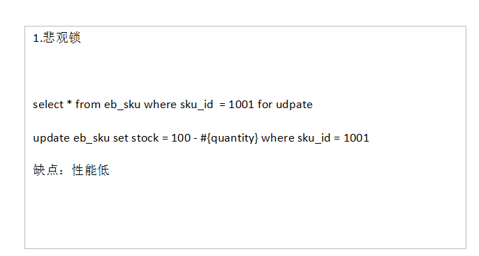
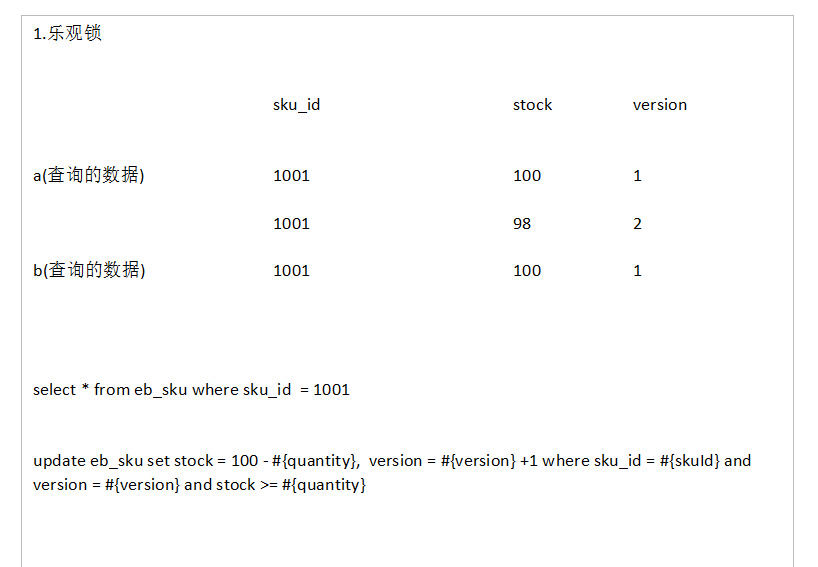
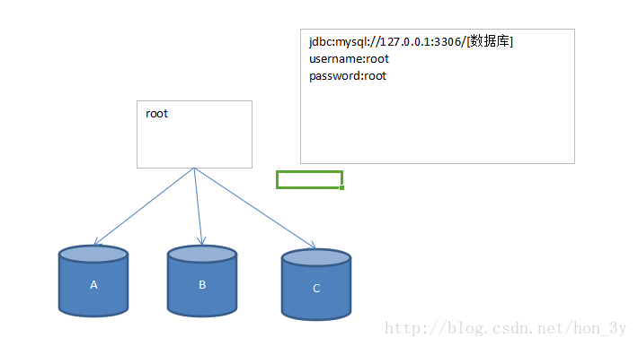
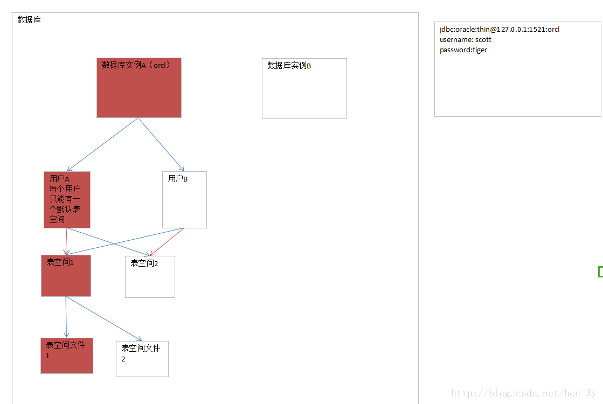

# Frontend Interview keypoints

   &nbsp &nbsp &nbsp &nbsp &nbsp

## 数据库

### 1. Redis和 mysql

1）类型上

从类型上来说，mysql是关系型数据库，redis是缓存数据库

2）作用上

mysql用于持久化的存储数据到硬盘，功能强大，但是速度较慢

redis用于存储使用较为频繁的数据到缓存中，读取速度快

3）需求上

mysql和redis因为需求的不同，一般都是配合使用。

### 2. 什么是存储过程？有哪些优缺点？

存储过程就像我们编程语言中的函数一样，封装了我们的代码(PLSQL、T-SQL)。

存储过程的优点：

能够将代码封装起来
保存在数据库之中
让编程语言进行调用
存储过程是一个预编译的代码块，执行效率比较高
一个存储过程替代大量T_SQL语句 ，可以降低网络通信量，提高通信速率

存储过程的缺点：

每个数据库的存储过程语法几乎都不一样，十分难以维护（不通用）
业务逻辑放在数据库上，难以迭代

### 3. 三个范式是什么

第一范式（1NF）：数据库表中的字段都是单一属性的，不可再分。这个单一属性由基本类型构成，包括整型、实数、字符型、逻辑型、日期型等。

第二范式（2NF）：数据库表中不存在非关键字段对任一候选关键字段的部分函数依赖（部分函数依赖指的是存在组合关键字中的某些字段决定非关键字段的情况），也即所有非关键字段都完全依赖于任意一组候选关键字。

第三范式（3NF）：在第二范式的基础上，数据表中如果不存在非关键字段对任一候选关键字段的传递函数依赖则符合第三范式。所谓传递函数依赖，指的是如果存在"A → B → C"的决定关系，则C传递函数依赖于A。因此，满足第三范式的数据库表应该不存在如下依赖关系： 关键字段 → 非关键字段x → 非关键字段y

首先要明确的是：满足着第三范式，那么就一定满足第二范式、满足着第二范式就一定满足第一范式

第一范式：字段是最小的的单元不可再分

学生信息组成学生信息表，有年龄、性别、学号等信息组成。这些字段都不可再分，所以它是满足第一范式的

第二范式：满足第一范式,表中的字段必须完全依赖于全部主键而非部分主键。

其他字段组成的这行记录和主键表示的是同一个东西，而主键是唯一的，它们只需要依赖于主键，也就成了唯一的
学号为1024的同学，姓名为Java3y，年龄是22岁。姓名和年龄字段都依赖着学号主键。

第三范式：满足第二范式，非主键外的所有字段必须互不依赖

就是数据只在一个地方存储，不重复出现在多张表中，可以认为就是消除传递依赖
比如，我们大学分了很多系（中文系、英语系、计算机系……），这个系别管理表信息有以下字段组成：系编号，系主任，系简介，系架构。那我们能不能在学生信息表添加系编号，系主任，系简介，系架构字段呢？不行的，因为这样就冗余了，非主键外的字段形成了依赖关系(依赖到学生信息表了)！正确的做法是：学生表就只能增加一个系编号字段。

### 4. 什么是视图？以及视图的使用场景有哪些？

视图是一种基于数据表的一种虚表

（1）视图是一种虚表

（2）视图建立在已有表的基础上, 视图赖以建立的这些表称为基表

（3）向视图提供数据内容的语句为 SELECT 语句,可以将视图理解为存储起来的 SELECT 语句

（4）视图向用户提供基表数据的另一种表现形式

（5）视图没有存储真正的数据，真正的数据还是存储在基表中

（6）程序员虽然操作的是视图，但最终视图还会转成操作基表

（7）一个基表可以有0个或多个视图

有的时候，我们可能只关系一张数据表中的某些字段，而另外的一些人只关系同一张数据表的某些字段...
那么把全部的字段都都显示给他们看，这是不合理的。
我们应该做到：他们想看到什么样的数据，我们就给他们什么样的数据...一方面就能够让他们只关注自己的数据，另一方面，我们也保证数据表一些保密的数据不会泄露出来...

我们在查询数据的时候，常常需要编写非常长的SQL语句，几乎每次都要写很长很长....上面已经说了，视图就是基于查询的一种虚表，也就是说，视图可以将查询出来的数据进行封装。。。那么我们在使用的时候就会变得非常方便...

值得注意的是：使用视图可以让我们专注与逻辑，但不提高查询效率

### 5. drop、delete与truncate分别在什么场景之下使用？

	操作 |使用场景
	:---- | :--- 
	drop table| 1)属于DDL 2)不可回滚 3)不可带where 4)表内容和结构删除 5)删除速度快
	truncate table| 1)属于DDL 2)不可回滚 3)不可带where  4)表内容删除 5)删除速度快
	delete from| 1)属于DML 2)可回滚  3)可带where  4)表结构在，表内容要看where执行的情况 5)删除速度慢,需要逐行删除
	
- 不再需要一张表的时候，用drop

- 想删除部分数据行时候，用delete，并且带上where子句

- 保留表而删除所有数据的时候用truncate

### 6. 索引是什么？有什么作用以及优缺点？

什么是索引【Index】

（1）是一种快速查询表中内容的机制，类似于新华字典的目录

（2）运用在表中某个些字段上，但存储时，独立于表之外

索引表把数据变成是有序的....

快速定位到硬盘中的数据文件...

### 7. rowid特点

(1) 位于每个表中，但表面上看不见，例如：desc emp是看不见的

(2）只有在select中，显示写出rowid，方可看见

(3）它与每个表绑定在一起，表亡，该表的rowid亡，二张表rownum可以相同，但rowid必须是唯一的

(4）rowid是18位大小写加数字混杂体，唯一表代该条记录在DBF文件中的位置

(5）rowid可以参与=/like比较时，用''单引号将rowid的值包起来，且区分大小写

(6）rowid是联系表与DBF文件的桥梁

### 8. 索引

**索引的特点**

（1）索引一旦建立,** Oracle管理系统会对其进行自动维护**, 而且由Oracle管理系统决定何时使用索引

（2）用户不用在查询语句中指定使用哪个索引

（3）在定义primary key或unique约束后系统自动在相应的列上创建索引

（4）用户也能按自己的需求，对指定单个字段或多个字段，添加索引

需要注意的是：Oracle是自动帮我们管理索引的，并且如果我们指定了primary key或者unique约束，系统会自动在对应的列上创建索引..

**什么时候【要】创建索引**

（1）表经常进行 SELECT 操作

（2）表很大(记录超多)，记录内容分布范围很广

（3）列名经常在 WHERE 子句或连接条件中出现

**什么时候【不要】创建索引**

（1）表经常进行 INSERT/UPDATE/DELETE 操作

（2）表很小(记录超少)

（3）列名不经常作为连接条件或出现在 WHERE 子句中

**索引优缺点**

- 索引加快数据库的检索速度

- 索引降低了插入、删除、修改等维护任务的速度(虽然索引可以提高查询速度，但是它们也会导致数据库系统更新数据的性能下降，因为大部分数据更新需要同时更新索引)

- 唯一索引可以确保每一行数据的唯一性，通过使用索引，可以在查询的过程中使用优化隐藏器，提高系统的性能

- 索引需要占物理和数据空间

**索引分类**

- 唯一索引：唯一索引不允许两行具有相同的索引值

- 主键索引：为表定义一个主键将自动创建主键索引，主键索引是唯一索引的特殊类型。主键索引要求主键中的每个值是唯一的，并且不能为空

- 聚集索引(Clustered)：表中各行的物理顺序与键值的逻辑（索引）顺序相同，每个表只能有一个

- 非聚集索引(Non-clustered)：非聚集索引指定表的逻辑顺序。数据存储在一个位置，索引存储在另一个位置，索引中包含指向数据存储位置的指针。可以有多个，小于249个

### 9. 什么是事物

事务简单来说：一个Session中所进行所有的操作，要么同时成功，要么同时失败
ACID — 数据库事务正确执行的四个基本要素

包含：原子性（Atomicity）、一致性（Consistency）、隔离性（Isolation）、持久性（Durability）。

一个支持事务（Transaction）中的数据库系统，必需要具有这四种特性，否则在事务过程（Transaction processing）当中无法保证数据的正确性，交易过程极可能达不到交易。
举个例子:A向B转账，转账这个流程中如果出现问题，事务可以让数据恢复成原来一样【A账户的钱没变，B账户的钱也没变】。

### 10. 事务隔离级别

数据库定义了4个隔离级别：

Serializable【可避免脏读，不可重复读，虚读】
Repeatable read【可避免脏读，不可重复读】
Read committed【可避免脏读】
Read uncommitted【级别最低，什么都避免不了】

分别对应Connection类中的4个常量

TRANSACTION_READ_UNCOMMITTED
TRANSACTION_READ_COMMITTED
TRANSACTION_REPEATABLE_READ
TRANSACTION_SERIALIZABLE

**脏读**：一个事务读取到另外一个事务未提交的数据

例子：A向B转账，A执行了转账语句，但A还没有提交事务，B读取数据，发现自己账户钱变多了！B跟A说，我已经收到钱了。A回滚事务【rollback】，等B再查看账户的钱时，发现钱并没有多。

**不可重复读**：一个事务读取到另外一个事务已经提交的数据，也就是说一个事务可以看到其他事务所做的修改

注：A查询数据库得到数据，B去修改数据库的数据，导致A多次查询数据库的结果都不一样【危害：A每次查询的结果都是受B的影响的，那么A查询出来的信息就没有意思了】

**虚读(幻读)**：是指在一个事务内读取到了别的事务插入的数据，导致前后读取不一致。

注：和不可重复读类似，但虚读(幻读)会读到其他事务的插入的数据，导致前后读取不一致

简单总结：脏读是不可容忍的，不可重复读和虚读在一定的情况下是可以的【做统计的肯定就不行】。

### 11. 数据库的乐观锁和悲观锁是什么？

确保在多个事务同时存取数据库中同一数据时不破坏事务的隔离性和统一性以及数据库的统一性，乐观锁和悲观锁是并发控制主要采用的技术手段。

**悲观锁**：假定会发生并发冲突，屏蔽一切可能违反数据完整性的操作

在查询完数据的时候就把事务锁起来，直到提交事务
实现方式：使用数据库中的锁机制

**乐观锁**：假设不会发生并发冲突，只在提交操作时检查是否违反数据完整性。

在修改数据的时候把事务锁起来，通过version的方式来进行锁定
实现方式：使用version版本或者时间戳

悲观锁：

乐观锁：

### 12. 超键、候选键、主键、外键分别是什么？

- 超键：在关系中能唯一标识元组的属性集称为关系模式的超键。一个属性可以为作为一个超键，多个属性组合在一起也可以作为一个超键。超键包含候选键和主键。

- 候选键(候选码)：是最小超键，即没有冗余元素的超键。

- 主键(主码)：数据库表中对储存数据对象予以唯一和完整标识的数据列或属性的组合。一个数据列只能有一个主键，且主键的取值不能缺失，即不能为空值（Null）。

- 外键：在一个表中存在的另一个表的主键称此表的外键。

候选码和主码：

例子：邮寄地址（城市名，街道名，邮政编码，单位名，收件人）

它有两个候选键:{城市名，街道名} 和 {街道名，邮政编码}

如果我选取{城市名，街道名}作为唯一标识实体的属性，那么{城市名，街道名} 就是主码(主键)

### 13. SQL 约束有哪几种？

- NOT NULL: 用于控制字段的内容一定不能为空（NULL）。

- UNIQUE: 控件字段内容不能重复，一个表允许有多个 Unique 约束。

- PRIMARY KEY: 也是用于控件字段内容不能重复，但它在一个表只允许出现一个。

- FOREIGN KEY: 用于预防破坏表之间连接的动作，也能防止非法数据插入外键列，因为它必须是它指向的那个表中的值之一。

- CHECK: 用于控制字段的值范围。

### 14. 数据库运行于哪种状态下可以防止数据的丢失？

在archivelog mode(归档模式)只要其归档日志文件不丢失，就可以有效地防止数据丢失。

### 15. Mysql存储引擎

常用的存储引擎有以下：

- Innodb引擎，Innodb引擎提供了对数据库ACID事务的支持。并且还提供了行级锁和外键的约束。它的设计的目标就是处理大数据容量的数据库系统。

- MyIASM引擎(原本Mysql的默认引擎),不提供事务的支持，也不支持行级锁和外键。

- MEMORY引擎：所有的数据都在内存中，数据的处理速度快，但是安全性不高。

同一个数据库也可以使用多种存储引擎的表。如果一个表修改要求比较高的事务处理，可以选择InnoDB。这个数据库中可以将查询要求比较高的表选择MyISAM存储。如果该数据库需要一个用于查询的临时表，可以选择MEMORY存储引擎。

### 16. MyIASM和Innodb两种引擎所使用的索引的数据结构是什么？

答案:都是B+树!

MyIASM引擎，B+树的数据结构中存储的内容实际上是实际数据的地址值。也就是说它的索引和实际数据是分开的，只不过使用索引指向了实际数据。这种索引的模式被称为非聚集索引。

Innodb引擎的索引的数据结构也是B+树，只不过数据结构中存储的都是实际的数据，这种索引有被称为聚集索引。

### 17. varchar和char的区别

Char是一种固定长度的类型，varchar是一种可变长度的类型

### 18. mysql有关权限的表都有哪几个

MySQL服务器通过权限表来控制用户对数据库的访问，权限表存放在mysql数据库里，由mysql_install_db脚本初始化。这些权限表分别user，db，table_priv，columns_priv和host。下面分别介绍一下这些表的结构和内容：

- user权限表：记录允许连接到服务器的用户帐号信息，里面的权限是全局级的。

- db权限表：记录各个帐号在各个数据库上的操作权限。

- table_priv权限表：记录数据表级的操作权限。

- columns_priv权限表：记录数据列级的操作权限。

- host权限表：配合db权限表对给定主机上数据库级操作权限作更细致的控制。这个权限表不受GRANT和REVOKE语句的影响。

### 19. 数据表损坏的修复方式有哪些？

使用 myisamchk 来修复，具体步骤：

1）修复前将mysql服务停止。

2）打开命令行方式，然后进入到mysql的/bin目录。

3）执行myisamchk –recover 数据库所在路径/*.MYI

使用repair table 或者 OPTIMIZE table命令来修复，REPAIR TABLE table_name 修复表 OPTIMIZE TABLE table_name 优化表 REPAIR TABLE 用于修复被破坏的表。
OPTIMIZE TABLE 用于回收闲置的数据库空间，当表上的数据行被删除时，所占据的磁盘空间并没有立即被回收，使用了OPTIMIZE TABLE命令后这些空间将被回收，并且对磁盘上的数据行进行重排（注意：是磁盘上，而非数据库）

### 20. MySQL中InnoDB引擎的行锁是通过加在什么上完成

InnoDB是基于索引来完成行锁

例: select * from tab_with_index where id = 1 for update;

for update 可以根据条件来完成行锁锁定,并且 id 是有索引键的列,
如果 id 不是索引键那么InnoDB将完成表锁,,并发将无从谈起

### 21. 数据库优化的思路

①选择最有效率的表名顺序

数据库的解析器按照从右到左的顺序处理FROM子句中的表名，FROM子句中写在最后的表将被最先处理

在FROM子句中包含多个表的情况下：

如果三个表是完全无关系的话，将记录和列名最少的表，写在最后，然后依次类推
也就是说：选择记录条数最少的表放在最后

如果有3个以上的表连接查询：

如果三个表是有关系的话，将引用最多的表，放在最后，然后依次类推。
也就是说：被其他表所引用的表放在最后

例如：查询员工的编号，姓名，工资，工资等级，部门名
emp表被引用得最多，记录数也是最多，因此放在form字句的最后面

	select emp.empno,emp.ename,emp.sal,salgrade.grade,dept.dname
	from salgrade,dept,emp
	where (emp.deptno = dept.deptno) and
	(emp.sal between salgrade.losal and salgrade.hisal)  		

②WHERE子句中的连接顺序

数据库采用自右而左的顺序解析WHERE子句,根据这个原理,表之间的连接必须写在其他WHERE条件之左,那些可以过滤掉最大数量记录的条件必须写在WHERE子句的之右。

emp.sal可以过滤多条记录，写在WHERE字句的最右边

	select emp.empno,emp.ename,emp.sal,dept.dname
	from dept,emp
	where (emp.deptno = dept.deptno) and (emp.sal > 1500) 

③SELECT子句中避免使用*号

我们当时学习的时候，“*”号是可以获取表中全部的字段数据的。

但是它要通过查询数据字典完成的，这意味着将耗费更多的时间
使用*号写出来的SQL语句也不够直观。

④用TRUNCATE替代DELETE

这里仅仅是：删除表的全部记录，除了表结构才这样做。

DELETE是一条一条记录的删除，而Truncate是将整个表删除，保留表结构，这样比DELETE快

⑤多使用内部函数提高SQL效率

例如使用mysql的concat()函数会比使用||来进行拼接快，因为concat()函数已经被mysql优化过了。

⑥使用表或列的别名

如果表或列的名称太长了，使用一些简短的别名也能稍微提高一些SQL的性能。毕竟要扫描的字符长度就变少了。。。

⑦多使用commit

comiit会释放回滚点...

⑧善用索引

索引就是为了提高我们的查询数据的，当表的记录量非常大的时候，我们就可以使用索引了。

**数据库结构优化**

1）范式优化： 比如消除冗余（节省空间。。）

2）反范式优化：比如适当加冗余等（减少join）

3）拆分表： 垂直拆分和水平拆分

**服务器硬件优化**

### 22. SQL练习题

基本表结构：

	student(sno,sname,sage,ssex)学生表
	course(cno,cname,tno) 课程表
	sc(sno,cno,score) 成绩表

	teacher(tno,tname) 教师表

**1，查询课程1的成绩比课程2的成绩高的所有学生的学号**

	select a.sno from
	(select sno,score from sc where cno=1) a,
	(select sno,score from sc where cno=2) b
	where a.score>b.score and a.sno=b.sno

**2，查询平均成绩大于60分的同学的学号和平均成绩**

	select a.sno as "学号", avg(a.score) as "平均成绩" 
	from
	(select sno,score from sc) a 
	group by sno having avg(a.score)>60

**3、查询各科成绩最高分和最低分**

	以如下形式显示：课程号，最高分，最低分
	select cno as 课程号, max(score) as 最高分, min(score) 最低分
	from sc group by cno

	select  course.cno as '课程号'
	,MAX(score) as '最高分'
	,MIN(score) as '最低分'
	from sc,course
	where sc.cno=course.cno
	group by course.cno

### 23. Oracle和Mysql的区别

在Mysql中，一个用户下可以创建多个库：

而在Oracle中，Oracle服务器是由两部分组成

数据库实例【理解为对象，看不见的】
数据库【理解为类，看得见的】
一个数据库实例可拥有多个用户，一个用户默认拥有一个表空间。

表空间是存储我们数据库表的地方，表空间内可以有多个文件。

当我们使用Oracle作为我们数据库时，我们需要指定用户、表空间来存储我们所需要的数据！

