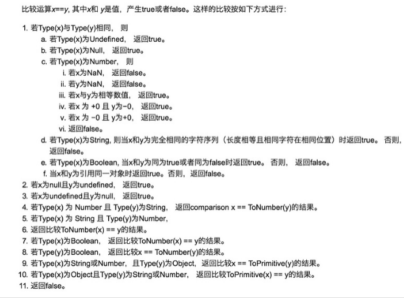

# Frontend Interview keypoints

<p align="center">   &nbsp &nbsp &nbsp &nbsp &nbsp
</p>

## JavaScript

### 1. get请求传参长度的误区

误区：我们经常说get请求参数的大小存在限制，而post请求的参数大小是无限制的。
实际上HTTP 协议从未规定 GET/POST 的请求长度限制是多少。对get请求参数的限制是来源与浏览器或web服务器，浏览器或web服务器限制了url的长度。为了明确这个概念，我们必须再次强调下面几点:

HTTP 协议 未规定 GET 和POST的长度限制

GET的最大长度显示是因为 浏览器和 web服务器限制了 URI的长度

不同的浏览器和WEB服务器，限制的最大长度不一样

要支持IE，则最大长度为2083byte，若只支持Chrome，则最大长度 8182byte

### 2. 补充get和post请求在缓存方面的区别

post/get的请求区别，具体不再赘述。

补充补充一个get和post在缓存方面的区别：

get请求类似于查找的过程，用户获取数据，可以不用每次都与数据库连接，所以可以使用缓存。

post不同，post做的一般是修改和删除的工作，所以必须与数据库交互，所以不能使用缓存。因此get请求适合于请求缓存。

### 3. 说一下闭包

一句话可以概括：闭包就是能够读取其他函数内部变量的函数，或者子函数在外调用，子函数所在的父函数的作用域不会被释放。

1）什么是闭包：

闭包是指有权访问另外一个函数作用域中的变量的函数。

闭包就是函数的局部变量集合，只是这些局部变量在函数返回后会继续存在。闭包就是就是函数的“堆栈”在函数返回后并不释放，我们也可以理解为这些函数堆栈并不在栈上分配而是在堆上分配。当在一个函数内定义另外一个函数就会产生闭包。

2）为什么要用：

匿名自执行函数：我们知道所有的变量，如果不加上var关键字，则默认的会添加到全局对象的属性上去，这样的临时变量加入全局对象有很多坏处，比如：别的函数可能误用这些变量；造成全局对象过于庞大，影响访问速度(因为变量的取值是需要从原型链上遍历的)。除了每次使用变量都是用var关键字外，我们在实际情况下经常遇到这样一种情况，即有的函数只需要执行一次，其内部变量无需维护，可以用闭包。

结果缓存：我们开发中会碰到很多情况，设想我们有一个处理过程很耗时的函数对象，每次调用都会花费很长时间，那么我们就需要将计算出来的值存储起来，当调用这个函数的时候，首先在缓存中查找，如果找不到，则进行计算，然后更新缓存并返回值，如果找到了，直接返回查找到的值即可。闭包正是可以做到这一点，因为它不会释放外部的引用，从而函数内部的值可以得以保留。

封装：实现类和继承等。


### 4. 说一下类的创建和继承

（1）类的创建（es5）：new一个function，在这个function的prototype里面增加属性和方法。
下面来创建一个Animal类：

// 定义一个动物类

function Animal (name) {

// 属性

this.name = name || 'Animal';

// 实例方法

this.sleep = function(){

console.log(this.name + '正在睡觉！');

}

}

// 原型方法

Animal.prototype.eat = function(food) {

console.log(this.name + '正在吃：' + food);

};

这样就生成了一个Animal类，实力化生成对象后，有方法和属性。


（2）类的继承——原型链继承

--原型链继承

```js
function Cat(){ }
Cat.prototype = new Animal();
Cat.prototype.name = 'cat';
//　Test Code
var cat = new Cat();
console.log(cat.name);
console.log(cat.eat('fish'));
console.log(cat.sleep());
console.log(cat instanceof Animal); //true
console.log(cat instanceof Cat); //true
```

介绍：在这里我们可以看到new了一个空对象,这个空对象指向Animal并且Cat.prototype指向了这个空对象，这种就是基于原型链的继承。

特点：基于原型链，既是父类的实例，也是子类的实例

缺点：无法实现多继承

（3）构造继承：使用父类的构造函数来增强子类实例，等于是复制父类的实例属性给子类（没用到原型）

```js
function Cat(name){
Animal.call(this);
this.name = name || 'Tom';
}
// Test Code
var cat = new Cat();
console.log(cat.name);
console.log(cat.sleep());
console.log(cat instanceof Animal); // false
console.log(cat instanceof Cat); // true
```

特点：可以实现多继承

缺点：只能继承父类实例的属性和方法，不能继承原型上的属性和方法。

（4）实例继承和拷贝继承

实例继承：为父类实例添加新特性，作为子类实例返回

拷贝继承：拷贝父类元素上的属性和方法

上述两个实用性不强，不一一举例。

（5）组合继承：相当于构造继承和原型链继承的组合体。通过调用父类构造，继承父类的属性并保留传参的优点，然后通过将父类实例作为子类原型，实现函数复用

```js
function Cat(name){
Animal.call(this);
this.name = name || 'Tom';
}
Cat.prototype = new Animal();
Cat.prototype.constructor = Cat;
// Test Code
var cat = new Cat();
console.log(cat.name);
console.log(cat.sleep());
console.log(cat instanceof Animal); // true
console.log(cat instanceof Cat); // true
```

特点：可以继承实例属性/方法，也可以继承原型属性/方法

缺点：调用了两次父类构造函数，生成了两份实例

（6）寄生组合继承：通过寄生方式，砍掉父类的实例属性，这样，在调用两次父类的构造的时候，就不会初始化两次实例方法/属性

```js
function Cat(name){
Animal.call(this);
this.name = name || 'Tom';
}

// 创建一个没有实例方法的类
var Super = function(){};
Super.prototype = Animal.prototype;

//将实例作为子类的原型

Cat.prototype = new Super();
})();
// Test Code
var cat = new Cat();
console.log(cat.name);
console.log(cat.sleep());
console.log(cat instanceof Animal); // true
console.log(cat instanceof Cat); //true
```

较为推荐

### 5. 如何解决异步回调地狱

promise、generator、async/await

### 6. 说说前端中的事件流

HTML中与javascript交互是通过事件驱动来实现的，例如鼠标点击事件onclick、页面的滚动事件onscroll等等，可以向文档或者文档中的元素添加事件侦听器来预订事件。想要知道这些事件是在什么时候进行调用的，就需要了解一下“事件流”的概念。

什么是事件流：事件流描述的是从页面中接收事件的顺序,DOM2级事件流包括下面几个阶段。

- 事件捕获阶段

- 处于目标阶段

- 事件冒泡阶段

addEventListener：addEventListener 是DOM2 级事件新增的指定事件处理程序的操作，这个方法接收3个参数：要处理的事件名、作为事件处理程序的函数和一个布尔值。最后这个布尔值参数如果是true，表示在捕获阶段调用事件处理程序；如果是false，表示在冒泡阶段调用事件处理程序。

IE只支持事件冒泡。


### 7. 如何让事件先冒泡后捕获

在DOM标准事件模型中，是先捕获后冒泡。但是如果要实现先冒泡后捕获的效果，对于同一个事件，监听捕获和冒泡，分别对应相应的处理函数，监听到捕获事件，先暂缓执行，直到冒泡事件被捕获后再执行捕获之间。

### 8. 说一下事件委托

简介：事件委托指的是，不在事件的发生地（直接dom）上设置监听函数，而是在其父元素上设置监听函数，通过事件冒泡，父元素可以监听到子元素上事件的触发，通过判断事件发生元素DOM的类型，来做出不同的响应。

举例：最经典的就是ul和li标签的事件监听，比如我们在添加事件时候，采用事件委托机制，不会在li标签上直接添加，而是在ul父元素上添加。

好处：比较合适动态元素的绑定，新添加的子元素也会有监听函数，也可以有事件触发机制。


### 9. 说一下图片的懒加载和预加载

预加载：提前加载图片，当用户需要查看时可直接从本地缓存中渲染。
懒加载：懒加载的主要目的是作为服务器前端的优化，减少请求数或延迟请求数。

两种技术的本质：两者的行为是相反的，一个是提前加载，一个是迟缓甚至不加载。

懒加载对服务器前端有一定的缓解压力作用，预加载则会增加服务器前端压力。

### 10. mouseover和mouseenter的区别

mouseover：当鼠标移入元素或其子元素都会触发事件，所以有一个重复触发，冒泡的过程。对应的移除事件是mouseout

mouseenter：当鼠标移除元素本身（不包含元素的子元素）会触发事件，也就是不会冒泡，对应的移除事件是mouseleave

### 11. js的new操作符做了哪些事情

new 操作符新建了一个空对象，这个对象原型指向构造函数的prototype，执行构造函数后返回这个对象。

### 12. 改变函数内部this指针的指向函数（bind，apply，call的区别）

通过apply和call改变函数的this指向，他们两个函数的第一个参数都是一样的表示要改变指向的那个对象，第二个参数，apply是数组，而call则是arg1,arg2...这种形式。通过bind改变this作用域会返回一个新的函数，这个函数不会马上执行。


### 13. js的各种位置，比如clientHeight,scrollHeight,offsetHeight ,以及scrollTop, offsetTop,clientTop的区别？

clientHeight：表示的是可视区域的高度，不包含border和滚动条

offsetHeight：表示可视区域的高度，包含了border和滚动条

scrollHeight：表示了所有区域的高度，包含了因为滚动被隐藏的部分。

clientTop：表示边框border的厚度，在未指定的情况下一般为0

scrollTop：滚动后被隐藏的高度，获取对象相对于由offsetParent属性指定的父坐标(css定位的元素或body元素)距离顶端的高度。

### 14. js拖拽功能的实现

首先是三个事件，分别是**mousedown，mousemove，mouseup**

当鼠标点击按下的时候，需要一个tag标识此时已经按下，可以执行mousemove里面的具体方法。


clientX，clientY标识的是鼠标的坐标，分别标识横坐标和纵坐标，并且我们用offsetX和offsetY来表示元素的元素的初始坐标，移动的举例应该是：


鼠标移动时候的坐标-鼠标按下去时候的坐标。


也就是说定位信息为：


鼠标移动时候的坐标-鼠标按下去时候的坐标+元素初始情况下的offetLeft.


还有一点也是原理性的东西，也就是拖拽的同时是绝对定位，我们改变的是绝对定位条件下的left
以及top等等值。


补充：也可以通过html5的拖放（Drag 和 drop）来实现


### 15. 异步加载js的方法

**defer**：只支持IE如果您的脚本不会改变文档的内容，可将 defer 属性加入到

	<script>
	
标签中，以便加快处理文档的速度。因为浏览器知道它将能够安全地读取文档的剩余部分而不用执行脚本，它将推迟对脚本的解释，直到文档已经显示给用户为止。

**async**，HTML5属性仅适用于外部脚本，并且如果在IE中，同时存在defer和async，那么defer的优先级比较高，脚本将在页面完成时执行。

创建script标签，插入到DOM中


### 16. Ajax解决浏览器缓存问题

- 在ajax发送请求前加上 anyAjaxObj.setRequestHeader("If-Modified-Since","0")。

- 在ajax发送请求前加上 anyAjaxObj.setRequestHeader("Cache-Control","no-cache")。

- 在URL后面加上一个随机数： "fresh=" + Math.random()。

- 在URL后面加上时间搓："nowtime=" + new Date().getTime()。

- 如果是使用jQuery，直接这样就可以了 $.ajaxSetup({cache:false})。这样页面的所有ajax都会执行这条语句就是不需要保存缓存记录。


### 17. js的节流和防抖

scroll 事件本身会触发页面的重新渲染，同时 scroll 事件的 handler 又会被高频度的触发, 因此事件的 handler 内部不应该有复杂操作，例如 DOM 操作就不应该放在事件处理中。

针对此类高频度触发事件问题（例如页面 scroll ，屏幕 resize，监听用户输入等），下面介绍两种常用的解决方法，防抖和节流。

**防抖（Debouncing**）
防抖技术即是可以把多个顺序地调用合并成一次，也就是在一定时间内，规定事件被触发的次数。

**节流（Throttling**
防抖函数确实不错，但是也存在问题，譬如图片的懒加载，我希望在下滑过程中图片不断的被加载出来，而不是只有当我停止下滑时候，图片才被加载出来。又或者下滑时候的数据的 ajax 请求加载也是同理。

这个时候，我们希望即使页面在不断被滚动，但是滚动 handler 也可以以一定的频率被触发（譬如 250ms 触发一次），这类场景，就要用到另一种技巧，称为节流函数（throttling）。

节流函数，只允许一个函数在 X 毫秒内执行一次。

与防抖相比，节流函数最主要的不同在于它保证在 X 毫秒内至少执行一次我们希望触发的事件 handler。

### 18. js的垃圾回收机制

必要性：由于字符串、对象和数组没有固定大小，所有当他们的大小已知时，才能对他们进行动态的存储分配。JavaScript程序每次创建字符串、数组或对象时，解释器都必须分配内存来存储那个实体。只要像这样动态地分配了内存，最终都要释放这些内存以便他们能够被再用，否则，JavaScript的解释器将会消耗完系统中所有可用的内存，造成系统崩溃。

这段话解释了为什么需要系统需要垃圾回收，JS不像C/C++，他有自己的一套垃圾回收机制（Garbage Collection）。JavaScript的解释器可以检测到何时程序不再使用一个对象了，当他确定了一个对象是无用的时候，他就知道不再需要这个对象，可以把它所占用的内存释放掉了。例如：

```js
var a="hello world";
var b="world";
var a=b;
```

//这时，会释放掉"hello world"，释放内存以便再引用

垃圾回收的方法：标记清除、计数引用。

**标记清除**

这是最常见的垃圾回收方式，当变量进入环境时，就标记这个变量为”进入环境“,从逻辑上讲，永远不能释放进入环境的变量所占的内存，永远不能释放进入环境变量所占用的内存，只要执行流程进入相应的环境，就可能用到他们。当离开环境时，就标记为离开环境。

垃圾回收器在运行的时候会给存储在内存中的变量都加上标记（所有都加），然后去掉环境变量中的变量，以及被环境变量中的变量所引用的变量（条件性去除标记），删除所有被标记的变量，删除的变量无法在环境变量中被访问所以会被删除，最后垃圾回收器，完成了内存的清除工作，并回收他们所占用的内存。

**引用计数法**

另一种不太常见的方法就是引用计数法，引用计数法的意思就是每个值没引用的次数，当声明了一个变量，并用一个引用类型的值赋值给改变量，则这个值的引用次数为1,；相反的，如果包含了对这个值引用的变量又取得了另外一个值，则原先的引用值引用次数就减1，当这个值的引用次数为0的时候，说明没有办法再访问这个值了，因此就把所占的内存给回收进来，这样垃圾收集器再次运行的时候，就会释放引用次数为0的这些值。

用引用计数法会存在内存泄露，下面来看原因：

```js
function problem() {
var objA = new Object();
var objB = new Object();
objA.someOtherObject = objB;
objB.anotherObject = objA;
}
```

在这个例子里面，objA和objB通过各自的属性相互引用，这样的话，两个对象的引用次数都为2，在采用引用计数的策略中，由于函数执行之后，这两个对象都离开了作用域，函数执行完成之后，因为计数不为0，这样的相互引用如果大量存在就会导致内存泄露。

### 19. eval是做什么的

它的功能是将对应的字符串解析成js并执行，应该避免使用js，因为非常消耗性能（2次，一次解析成js，一次执行）

### 20. 如何理解前端模块化

前端模块化就是复杂的文件编程一个一个独立的模块，比如js文件等等，分成独立的模块有利于重用（复用性）和维护（版本迭代），这样会引来模块之间相互依赖的问题，所以有了commonJS规范，AMD，CMD规范等等，以及用于js打包（编译等处理）的工具webpack

### 21.  说一下Commonjs、AMD和CMD

一个模块是能实现特定功能的文件，有了模块就可以方便的使用别人的代码，想要什么功能就能加载什么模块。

Commonjs：开始于服务器端的模块化，同步定义的模块化，每个模块都是一个单独的作用域，模块输出，modules.exports，模块加载require()引入模块。

AMD：中文名异步模块定义的意思。

requireJS实现了AMD规范，主要用于解决下述两个问题。

1.多个文件有依赖关系，被依赖的文件需要早于依赖它的文件加载到浏览器


2.加载的时候浏览器会停止页面渲染，加载文件越多，页面失去响应的时间越长。

语法：requireJS定义了一个函数define，它是全局变量，用来定义模块。

requireJS的例子：

```js
//定义模块
define(['dependency'], function(){
var name = 'Byron';
function printName(){
console.log(name);
}
return {
printName: printName
};
});

//加载模块

require(['myModule'], function (my){
my.printName();
}
```

requirejs定义了一个函数define,它是全局变量，用来定义模块：

define(id?dependencies?,factory)

在页面上使用模块加载函数：

require([dependencies],factory)；

总结AMD规范：require（）函数在加载依赖函数的时候是异步加载的，这样浏览器不会失去响应，它指定的回调函数，只有前面的模块加载成功，才会去执行。
因为网页在加载js的时候会停止渲染，因此我们可以通过异步的方式去加载js,而如果需要依赖某些，也是异步去依赖，依赖后再执行某些方法。

### 22.  对象深度克隆的简单实现

ES5的常用的对象克隆的一种方式。注意数组是对象，但是跟对象又有一定区别，所以我们一开始判断了一些类型，决定newObj是对象还是数组~

```js
function deepClone(obj){
var newObj= obj instanceof Array ? []:{};
for(var item in obj){
var temple= typeof obj[item] == 'object' ? deepClone(obj[item]):obj[item];
newObj[item] = temple;
}
return newObj;
}
```

### 23. 实现一个once函数，传入函数参数只执行一次

```js
function ones(func){
var tag=true;
return function(){
if(tag==true){
func.apply(null,arguments);
tag=false;
}
return undefined
}
}
```

### 24. 将原生的ajax封装成promise

```js
var  myNewAjax=function(url){
return new Promise(function(resolve,reject){
var xhr = new XMLHttpRequest();
xhr.open('get',url);
xhr.send(data);
xhr.onreadystatechange=function(){
if(xhr.status==200&&readyState==4){
var json=JSON.parse(xhr.responseText);
resolve(json)
}else if(xhr.readyState==4&&xhr.status!=200){
reject('error');
}
}
})
}
```

### 25. js监听对象属性的改变

我们假设这里有一个user对象,
(1)在ES5中可以通过Object.defineProperty来实现已有属性的监听

```js
Object.defineProperty(user,'name',{
set：function(key,value){
}
})
```
缺点：如果id不在user对象中，则不能监听id的变化

(2)在ES6中可以通过Proxy来实现

```js
var  user = new Proxy({}，{
set：function(target,key,value,receiver){
}
})
```
这样即使有属性在user中不存在，通过user.id来定义也同样可以这样监听这个属性的变化哦~

### 26. 如何实现一个私有变量，用getName方法可以访问，不能直接访问

(1)通过defineProperty来实现

```js
obj={
name:yuxiaoliang,
getName:function(){
return this.name
}
}
object.defineProperty(obj,"name",{
//不可枚举不可配置

});
```

(2)通过函数的创建形式

```js
function product(){
var name='yuxiaoliang';
this.getName=function(){
return name;
}
}
var obj=new product();
```

### 27.  ==和===、以及Object.is的区别

(1) ==
主要存在：强制转换成number,null==undefined

" "==0  //true

"0"==0  //true

" " !="0" //true

123=="123" //true

null==undefined //true

(2)Object.js

主要的区别就是+0！=-0 而NaN==NaN
(相对比===和==的改进)

### 28. setTimeout、setInterval和requestAnimationFrame之间的区别

与setTimeout和setInterval不同，requestAnimationFrame不需要设置时间间隔，
大多数电脑显示器的刷新频率是60Hz，大概相当于每秒钟重绘60次。大多数浏览器都会对重绘操作加以限制，不超过显示器的重绘频率，因为即使超过那个频率用户体验也不会有提升。因此，最平滑动画的最佳循环间隔是1000ms/60，约等于16.6ms。

RAF采用的是系统时间间隔，不会因为前面的任务，不会影响RAF，但是如果前面的任务多的话，
会响应setTimeout和setInterval真正运行时的时间间隔。

特点：

（1）requestAnimationFrame会把每一帧中的所有DOM操作集中起来，在一次重绘或回流中就完成，并且重绘或回流的时间间隔紧紧跟随浏览器的刷新频率。

（2）在隐藏或不可见的元素中，requestAnimationFrame将不会进行重绘或回流，这当然就意味着更少的CPU、GPU和内存使用量

（3）requestAnimationFrame是由浏览器专门为动画提供的API，在运行时浏览器会自动优化方法的调用，并且如果页面不是激活状态下的话，动画会自动暂停，有效节省了CPU开销。


### 29. 自己实现一个bind函数

原理：通过apply或者call方法来实现。

(1)初始版本

```js
Function.prototype.bind=function(obj,arg){
var arg=Array.prototype.slice.call(arguments,1);
var context=this;
return function(newArg){
arg=arg.concat(Array.prototype.slice.call(newArg));
return context.apply(obj,arg);
}
}
```

(2) 考虑到原型链

为什么要考虑？因为在new 一个bind过生成的新函数的时候，必须的条件是要继承原函数的原型

```js
Function.prototype.bind=function(obj,arg){
var arg=Array.prototype.slice.call(arguments,1);
var context=this;
var bound=function(newArg){
arg=arg.concat(Array.prototype.slice.call(newArg));
return context.apply(obj,arg);
}
var F=function(){}

//这里需要一个寄生组合继承

F.prototype=context.prototype;
bound.prototype=new F();
return bound;
}

```

### 30. 用setTimeout来实现setInterval

(1)用setTimeout()方法来模拟setInterval()与setInterval()之间的什么区别？
首先来看setInterval的缺陷，使用setInterval()创建的定时器确保了定时器代码规则地插入队列中。这个问题在于：如果定时器代码在代码再次添加到队列之前还没完成执行，结果就会导致定时器代码连续运行好几次。而之间没有间隔。不过幸运的是：javascript引擎足够聪明，能够避免这个问题。当且仅当没有该定时器的如何代码实例时，才会将定时器代码添加到队列中。这确保了定时器代码加入队列中最小的时间间隔为指定时间。

这种重复定时器的规则有两个问题：1.某些间隔会被跳过 2.多个定时器的代码执行时间可能会比预期小。

下面举例子说明：

假设，某个onclick事件处理程序使用啦setInterval()来设置了一个200ms的重复定时器。如果事件处理程序花了300ms多一点的时间完成。


这个例子中的第一个定时器是在205ms处添加到队列中，但是要过300ms才能执行。在405ms又添加了一个副本。在一个间隔，605ms处，第一个定时器代码还在执行中，而且队列中已经有了一个定时器实例，结果是605ms的定时器代码不会添加到队列中。结果是在5ms处添加的定时器代码执行结束后，405处的代码立即执行。

```js
function say(){
//something
setTimeout(say,200);
}
setTimeout(say,200)
```

或者

```js
setTimeout(function(){
//do something
setTimeout(arguments.callee,200);
},200);
```

### 31. js怎么控制一次加载一张图片，加载完后再加载下一张

(1)方法1

```js
<script type="text/javascript">
var obj=new Image();
obj.src="http://www.phpernote.com/uploadfiles/editor/201107240502201179.jpg";
obj.onload=function(){
alert('图片的宽度为：'+obj.width+'；图片的高度为：'+obj.height);
document.getElementById("mypic").innnerHTML="";
}
</script>

<div id="mypic">onloading……</div>

```


(2)方法2

```js
<script type="text/javascript">
var obj=new Image();
obj.src="http://www.phpernote.com/uploadfiles/editor/201107240502201179.jpg";
obj.onreadystatechange=function(){
if(this.readyState=="complete"){

alert('图片的宽度为：'+obj.width+'；图片的高度为：'+obj.height);

document.getElementById("mypic").innnerHTML="";
}
}
</script>

<div id="mypic">onloading……</div>
```

### 31. 代码的执行顺序

```js
setTimeout(function(){console.log(1)},0);

new Promise(function(resolve,reject){
console.log(2);
resolve();
}).then(function(){console.log(3)
}).then(function(){console.log(4)});
process.nextTick(function(){console.log(5)});

console.log(6);
```

//输出2,6,5,3,4,1


### 32. 如何实现sleep的效果（es5或者es6）

(1)while循环的方式

```js
function sleep(ms){
var start=Date.now(),expire=start+ms;
while(Date.now()<expire);
console.log('1111');
return;
}
```

执行sleep(1000)之后，休眠了1000ms之后输出了1111。上述循环的方式缺点很明显，容易造成死循环。


(2)通过promise来实现

```js
function sleep(ms){
var temple=new Promise(
(resolve)=>{
console.log(111);setTimeout(resolve,ms)
});
return temple
}
sleep(500).then(function(){
//console.log(222)
})
```
//先输出了111，延迟500ms后输出222

(3)通过async封装

```js
function sleep(ms){
return new Promise((resolve)=>setTimeout(resolve,ms));
}
async function test(){
var temple=await sleep(1000);
console.log(1111)
return temple
}
test();
```

//延迟1000ms输出了1111

(4).通过generate来实现

```js
function* sleep(ms){
yield new Promise(function(resolve,reject){
console.log(111);
setTimeout(resolve,ms);
})
}
sleep(500).next().value.then(function(){console.log(2222)})
```

### 33. 简单的实现一个promise

1.术语

（1）"promise"是一个对象或者函数，该对象或者函数有一个then方法

（2）"thenable"是一个对象或者函数，用来定义then方法

（3）"value"是promise状态成功时的值

（4）"reason"是promise状态失败时的值

2.要求

（1）一个promise必须有3个状态，pending，fulfilled(resolved)，rejected当处于pending状态的时候，可以转移到fulfilled(resolved)或者rejected状态。当处于fulfilled(resolved)状态或者rejected状态的时候，就不可变。

promise英文译为承诺，也就是说promise的状态一旦发生改变，就永远是不可逆的。

（2）一个promise必须有一个then方法，then方法接受两个参数：

	promise.then(onFulfilled,onRejected)
	
其中onFulfilled方法表示状态从pending——>fulfilled(resolved)时所执行的方法，而onRejected表示状态从pending——>rejected所执行的方法。

（3）为了实现链式调用，then方法必须返回一个promise

	promise2=promise1.then(onFulfilled,onRejected)


3.实现一个符合Promise/A+规范的Promise

解读了Promise/A+规范之后，下面我们来看如何实现一个Promise,
首先构造一个myPromise函数，关于所有变量和函数名，应该与规范中保持相同。

1.v1.0 初始版本myPromise

```js
function myPromise(constructor){
    let self=this;
    self.status="pending" //定义状态改变前的初始状态
    self.value=undefined;//定义状态为resolved的时候的状态
    self.reason=undefined;//定义状态为rejected的时候的状态
    function resolve(value){
        //两个==="pending"，保证了状态的改变是不可逆的
       if(self.status==="pending"){
          self.value=value;
          self.status="resolved";
       }
    }
    function reject(reason){
        //两个==="pending"，保证了状态的改变是不可逆的
       if(self.status==="pending"){
          self.reason=reason;
          self.status="rejected";
       }
    }
    //捕获构造异常
    try{
       constructor(resolve,reject);
    }catch(e){
       reject(e);
    }
}

```

同时，需要在myPromise的原型上定义链式调用的then方法：

```js
myPromise.prototype.then=function(onFullfilled,onRejected){
   let self=this;
   switch(self.status){
      case "resolved":
        onFullfilled(self.value);
        break;
      case "rejected":
        onRejected(self.reason);
        break;
      default:       
   }
}
```

上述就是一个初始版本的myPromise，在myPromise里发生状态改变，然后在相应的then方法里面根据不同的状态可以执行不同的操作。

	var p=new myPromise(function(resolve,reject){resolve(1)});
	p.then(function(x){console.log(x)})
	//输出1


### 34. Function._proto_(getPrototypeOf)是什么？

获取一个对象的原型，在chrome中可以通过_proto_的形式，或者在ES6中可以通过Object.getPrototypeOf的形式。
那么Function.proto是什么么？也就是说Function由什么对象继承而来，我们来做如下判别。

Function.__proto__==Object.prototype //false

Function.__proto__==Function.prototype//true

我们发现Function的原型也是Function。

我们用图可以来明确这个关系：


### 35. 实现js中所有对象的深度克隆（包装对象，Date对象，正则对象）

通过递归可以简单实现对象的深度克隆，但是这种方法不管是ES6还是ES5实现，都有同样的缺陷，就是只能实现特定的object的深度复制（比如数组和函数），不能实现包装对象Number，String ， Boolean，以及Date对象，RegExp对象的复制。

(1)前文的方法

```js
function deepClone(obj){
var newObj= obj instanceof Array?[]:{};
for(var i in obj){
newObj[i]=typeof obj[i]=='object'?
deepClone(obj[i]):obj[i];
}
return newObj;
}
```

这种方法可以实现一般对象和数组对象的克隆，比如：

```js
var arr=[1,2,3];
var newArr=deepClone(arr);
// newArr->[1,2,3]
var obj={
x:1,
y:2
}
var newObj=deepClone(obj);
// newObj={x:1,y:2}

```

但是不能实现例如包装对象Number,String,Boolean,以及正则对象RegExp和Date对象的克隆，比如：

```js
//Number包装对象
var num=new Number(1);
typeof num // "object"
var newNum=deepClone(num);
//newNum ->  {} 空对象
```

(2)valueof()函数

所有对象都有valueOf方法，valueOf方法对于：如果存在任意原始值，它就默认将对象转换为表示它的原始值。对象是复合值，而且大多数对象无法真正表示为一个原始值，因此默认的valueOf()方法简单地返回对象本身，而不是返回一个原始值。数组、函数和正则表达式简单地继承了这个默认方法，调用这些类型的实例的valueOf()方法只是简单返回这个对象本身。

对于原始值或者包装类：

```js
function baseClone(base){
return base.valueOf();
}
//Number
var num=new Number(1);
var newNum=baseClone(num);
//newNum->1
//String
var str=new String('hello');
var newStr=baseClone(str);
// newStr->"hello"
//Boolean
var bol=new Boolean(true);
var newBol=baseClone(bol);
//newBol-> true
```

其实对于包装类，完全可以用=号来进行克隆，其实没有深度克隆一说，

这里用valueOf实现，语法上比较符合规范。

对于Date类型：

因为valueOf方法，日期类定义的valueOf()方法会返回它的一个内部表示：1970年1月1日以来的毫秒数.因此我们可以在Date的原型上定义克隆的方法：

```js
Date.prototype.clone=function(){
return new Date(this.valueOf());
}
var date=new Date('2010');
var newDate=date.clone();
// newDate->  Fri Jan 01 2010 08:00:00 GMT+0800

```

对于正则对象RegExp：

```js
RegExp.prototype.clone = function() {
var pattern = this.valueOf();
var flags = '';
flags += pattern.global ? 'g' : '';
flags += pattern.ignoreCase ? 'i' : '';
flags += pattern.multiline ? 'm' : '';
return new RegExp(pattern.source, flags);
};
var reg=new RegExp('/111/');
var newReg=reg.clone();
//newReg->  /\/111\//
```


### 36. 简单实现Node的Events模块

简介：观察者模式或者说订阅模式，它定义了对象间的一种一对多的关系，让多个观察者对象同时监听某一个主题对象，当一个对象发生改变时，所有依赖于它的对象都将得到通知。

node中的Events模块就是通过观察者模式来实现的：

```js
var events=require('events');
var eventEmitter=new events.EventEmitter();
eventEmitter.on('say',function(name){
console.log('Hello',name);
})
eventEmitter.emit('say','Jony yu');
```

这样，eventEmitter发出say事件，通过On接收，并且输出结果，这就是一个订阅模式的实现，下面我们来简单的实现一个Events模块的EventEmitter。

(1)实现简单的Event模块的emit和on方法

```js
function Events(){
this.on=function(eventName,callBack){
if(!this.handles){
this.handles={};
}
if(!this.handles[eventName]){
this.handles[eventName]=[];
}
this.handles[eventName].push(callBack);
}
this.emit=function(eventName,obj){
if(this.handles[eventName]){
for(var i=0;o<this.handles[eventName].length;i++){
this.handles[eventName][i](obj);
}
}
}
return this;
}
```

这样我们就定义了Events，现在我们可以开始来调用：

```js
var events=new Events();
events.on('say',function(name){
console.log('Hello',nama)
});
events.emit('say','Jony yu');

//结果就是通过emit调用之后，输出了Jony yu
```

(2)每个对象是独立的

因为是通过new的方式，每次生成的对象都是不相同的，因此：

```js
var event1=new Events();
var event2=new Events();
event1.on('say',function(){
console.log('Jony event1');
});
event2.on('say',function(){
console.log('Jony event2');
})
event1.emit('say');
event2.emit('say');

//event1、event2之间的事件监听互相不影响

//输出结果为'Jony event1' 'Jony event2'
```

### 37. 箭头函数中this指向举例

```js
var a=11;
function test2(){
this.a=22;
let b=()=>{console.log(this.a)}
b();
}
var x=new test2();
```

//输出22


### 38. js判断类型

判断方法：typeof()，**instanceof**，**Object.prototype.toString.call()**等

### 39. 数组常用方法

push()，pop()，shift()，unshift()，splice()，sort()，reverse()，map()等

### 40. 数组去重

法一：indexOf循环去重

法二：ES6 Set去重；Array.from(new Set(array))

法三：Object 键值对去重；把数组的值存成 Object 的 key 值，比如 Object[value1] = true，在判断另一个值的时候，如果 Object[value2]存在的话，就说明该值是重复的。

### 41. 去除字符串首尾空格

使用正则(^\s*)|(\s*$)即可

### 42. 事件代理在捕获阶段的实际应用

可以在父元素层面阻止事件向子元素传播，也可代替子元素执行某些操作。

### 43. 性能优化

- 减少HTTP请求

- 使用内容发布网络（CDN）

- 添加本地缓存

- 压缩资源文件

- 将CSS样式表放在顶部，把javascript放在底部（浏览器的运行机制决定）

- 避免使用CSS表达式

- 减少DNS查询

- 使用外部javascript和CSS

- 避免重定向

- 图片lazyLoad

### 44. 能来讲讲JS的语言特性吗

- 运行在客户端浏览器上；

- 不用预编译，直接解析执行代码；

- 是弱类型语言，较为灵活；

- 与操作系统无关，跨平台的语言；

- 脚本语言、解释性语言

### 45. JS实现跨域

**跨域的原理**：跨域，是指浏览器不能执行其他网站的脚本。它是由浏览器的同源策略造成的，是浏览器对JavaScript实施的安全限制，那么只要协议、域名、端口有任何一个不同，都被当作是不同的域。跨域原理，即是通过各种方式，避开浏览器的安全限制。

- JSONP：通过动态创建script，再请求一个带参网址实现跨域通信。document.domain + iframe跨域：两个页面都通过js强制设置document.domain为基础主域，就实现了同域。

- location.hash + iframe跨域：a欲与b跨域相互通信，通过中间页c来实现。 三个页面，不同域之间利用iframe的location.hash传值，相同域之间直接js访问来通信。

- window.name + iframe跨域：通过iframe的src属性由外域转向本地域，跨域数据即由iframe的window.name从外域传递到本地域。

- postMessage跨域：可以跨域操作的window属性之一。

- CORS：服务端设置Access-Control-Allow-Origin即可，前端无须设置，若要带cookie请求，前后端都需要设置。

- 代理跨域：启一个代理服务器，实现数据的转发

### 46. Js基本数据类型

基本数据类型：undefined、null、number、boolean、string、symbol

### 47. 重排和重绘，讲讲看

重绘（repaint或redraw）：当盒子的位置、大小以及其他属性，例如颜色、字体大小等都确定下来之后，浏览器便把这些原色都按照各自的特性绘制一遍，将内容呈现在页面上。重绘是指一个元素外观的改变所触发的浏览器行为，浏览器会根据元素的新属性重新绘制，使元素呈现新的外观。
触发重绘的条件：改变元素外观属性。如：color，background-color等。

注意：table及其内部元素可能需要多次计算才能确定好其在渲染树中节点的属性值，比同等元素要多花两倍时间，这就是我们尽量避免使用table布局页面的原因之一。

重排（重构/回流/reflow）：当渲染树中的一部分(或全部)因为元素的规模尺寸，布局，隐藏等改变而需要重新构建, 这就称为回流(reflow)。每个页面至少需要一次回流，就是在页面第一次加载的时候。

重绘和重排的关系：在回流的时候，浏览器会使渲染树中受到影响的部分失效，并重新构造这部分渲染树，完成回流后，浏览器会重新绘制受影响的部分到屏幕中，该过程称为重绘。所以，重排必定会引发重绘，但重绘不一定会引发重排。

### 48. JS的全排列

```js
function permutate(str) {
var result = [];
if(str.length > 1) {
var left = str[0];
var rest = str.slice(1, str.length);
var preResult = permutate(rest);
for(var i=0; i<preResult.length; i++) {
for(var j=0; j<preResult[i].length; j++) {
var tmp = preResult[i],slice(0, j) + left + preResult[i].slice(j, preResult[i].length);
result.push(tmp);
}
}
} else if (str.length == 1) {
return [str];
}
return result;
}
```

### 49. 不同数据类型的值的比较，是怎么转换的，有什么规则

<p align="center"></p>


### 50. null == undefined为什么

要比较相等性之前，不能将null 和 undefined 转换成其他任何值，但 null == undefined 会返回 true 。ECMAScript规范中是这样定义的。

### 51. this的指向 哪几种

默认绑定：全局环境中，this默认绑定到window。
隐式绑定：一般地，被直接对象所包含的函数调用时，也称为方法调用，this隐式绑定到该直接对象。

隐式丢失：隐式丢失是指被隐式绑定的函数丢失绑定对象，从而默认绑定到window。显式绑定：通过call()、apply()、bind()方法把对象绑定到this上，叫做显式绑定。

new绑定：如果函数或者方法调用之前带有关键字new，它就构成构造函数调用。对于this绑定来说，称为new绑定。

【1】构造函数通常不使用return关键字，它们通常初始化新对象，当构造函数的函数体执行完毕时，它会显式返回。在这种情况下，构造函数调用表达式的计算结果就是这个新对象的值。

【2】如果构造函数使用return语句但没有指定返回值，或者返回一个原始值，那么这时将忽略返回值，同时使用这个新对象作为调用结果。

【3】如果构造函数显式地使用return语句返回一个对象，那么调用表达式的值就是这个对象。


### 52. 暂停死区

在代码块内，使用let、const命令声明变量之前，该变量都是不可用的。这在语法上，称为“暂时性死区”


### 53. requestAnimationFrame，请问是怎么使用的

requestAnimationFrame() 方法告诉浏览器您希望执行动画并请求浏览器在下一次重绘之前调用指定的函数来更新动画。该方法使用一个回调函数作为参数，这个回调函数会在浏览器重绘之前调用。

### 54. 有一个游戏叫做Flappy Bird，就是一只小鸟在飞，前面是无尽的沙漠，上下不断有钢管生成，你要躲避钢管。然后小明在玩这个游戏时候老是卡顿甚至崩溃，说出原因（3-5个）以及解决办法（3-5个）

原因可能是：

1.内存溢出问题。

2.资源过大问题。

3.资源加载问题。

4.canvas绘制频率问题

解决办法：

1.针对内存溢出问题，我们应该在钢管离开可视区域后，销毁钢管，让垃圾收集器回收钢管，因为不断生成的钢管不及时清理容易导致内存溢出游戏崩溃。

2.针对资源过大问题，我们应该选择图片文件大小更小的图片格式，比如使用webp、png格式的图片，因为绘制图片需要较大计算量。

3.针对资源加载问题，我们应该在可视区域之前就预加载好资源，如果在可视区域生成钢管的话，用户的体验就认为钢管是卡顿后才生成的，不流畅。

4.针对canvas绘制频率问题，我们应该需要知道大部分显示器刷新频率为60次/s,因此游戏的每一帧绘制间隔时间需要小于1000/60=16.7ms，才能让用户觉得不卡顿。

（注意因为这是单机游戏，所以回答与网络无关）


### 55. 编写代码，满足以下条件： 

	(1）Hero("37er");执行结果为 Hi! This is 37er 
	(2）Hero("37er").kill(1).recover(30);执行结果为 
	 Hi! This is 37er Kill 1 bug Recover 30 bloods 
	(3）Hero("37er").sleep(10).kill(2) 执行结果为 
	 Hi! This is 37er //等待10s后 Kill 2 bugs  
	 //注意为bugs （双斜线后的为提示信息，不需要打印）

```js
function Hero(name){
let o=new Object();
o.name=name;
o.time=0;
console.log("Hi! This is "+o.name);
o.kill=function(bugs) {
if(bugs==1){
console.log("Kill "+(bugs)+" bug");
}else {
setTimeout(function () {
console.log("Kill " + (bugs) + " bugs");
}, 1000 * this.time);
}
return o;
};
o.recover=function (bloods) {
console.log("Recover "+(bloods)+" bloods");
return o;
}
o.sleep=function (sleepTime) {
o.time=sleepTime;
return o;
}
return o;
}
```

### 56. 什么是按需加载

当用户触发了动作时才加载对应的功能。触发的动作，是要看具体的业务场景而言，包括但不限于以下几个情况：鼠标点击、输入文字、拉动滚动条，鼠标移动、窗口大小更改等。加载的文件，可以是JS、图片、CSS、HTML等。

### 57. 说一下什么是virtual dom

用JavaScript 对象结构表示 DOM 树的结构；然后用这个树构建一个真正的 DOM 树，插到文档当中 当状态变更的时候，重新构造一棵新的对象树。然后用新的树和旧的树进行比较，记录两棵树差异 把所记录的差异应用到所构建的真正的DOM树上，视图就更新了。Virtual DOM 本质上就是在 JS 和 DOM 之间做了一个缓存。

### 58. webpack用来干什么的

webpack 是一个现代 JavaScript 应用程序的静态模块打包器(module bundler)。当 webpack 处理应用程序时，它会递归地构建一个依赖关系图(dependency graph)，其中包含应用程序需要的每个模块，然后将所有这些模块打包成一个或多个bundle。

### 59. ant-design优点和缺点

优点：组件非常全面，样式效果也都比较不错。

缺点：框架自定义程度低，默认UI风格修改困难。

### 60. JS中继承实现的几种方式

1、原型链继承，将父类的实例作为子类的原型，他的特点是实例是子类的实例也是父类的实例，父类新增的原型方法/属性，子类都能够访问，并且原型链继承简单易于实现，缺点是来自原型对象的所有属性被所有实例共享，无法实现多继承，无法向父类构造函数传参。

2、构造继承，使用父类的构造函数来增强子类实例，即复制父类的实例属性给子类，

构造继承可以向父类传递参数，可以实现多继承，通过call多个父类对象。但是构造继承只能继承父类的实例属性和方法，不能继承原型属性和方法，无法实现函数服用，每个子类都有父类实例函数的副本，影响性能

3、实例继承，为父类实例添加新特性，作为子类实例返回，实例继承的特点是不限制调用方法，不管是new 子类（）还是子类（）返回的对象具有相同的效果，缺点是实例是父类的实例，不是子类的实例，不支持多继承

4、拷贝继承：特点：支持多继承，缺点：效率较低，内存占用高（因为要拷贝父类的属性）无法获取父类不可枚举的方法（不可枚举方法，不能使用for in 访问到）

5、组合继承：通过调用父类构造，继承父类的属性并保留传参的优点，然后通过将父类实例作为子类原型，实现函数复用

6、寄生组合继承：通过寄生方式，砍掉父类的实例属性，这样，在调用两次父类的构造的时候，就不会初始化两次实例方法/属性，避免的组合继承的缺点

### 61. 写一个函数，第一秒打印1，第二秒打印2

两个方法，第一个是用let块级作用域

```js
for(let i=0;i<5;i++){
setTimeout(function(){
console.log(i)
},1000*i)
}
```

第二个方法闭包

```js
for(var i=0;i<5;i++){
(function(i){
setTimeout(function(){
console.log(i)
},1000*i)
})(i)
}
```

### 62. 简单介绍一下symbol

Symbol是ES6 的新增属性，代表用给定名称作为唯一标识，这种类型的值可以这样创建，
	
	let id=symbol(“id”)

Symbl确保唯一，即使采用相同的名称，也会产生不同的值，我们创建一个字段，仅为知道对应symbol的人能访问，使用symbol很有用，symbol并不是100%隐藏，有内置方法

	Object.getOwnPropertySymbols(obj)

可以获得所有的symbol。 也有一个方法

	Reflect.ownKeys(obj)

返回对象所有的键，包括symbol。
所以并不是真正隐藏。但大多数库内置方法和语法结构遵循通用约定他们是隐藏的，


### 63. 什么是事件监听.

addEventListener()方法，用于向指定元素添加事件句柄，它可以更简单的控制事件，语法为
element.addEventListener(event, function, useCapture);

第一个参数是事件的类型(如 "click" 或 "mousedown").

第二个参数是事件触发后调用的函数。

第三个参数是个布尔值用于描述事件是冒泡还是捕获。该参数是可选的。

事件传递有两种方式，冒泡和捕获

事件传递定义了元素事件触发的顺序，如果你将P元素插入到div元素中，用户点击P元素，

在冒泡中，内部元素先被触发，然后再触发外部元素，

捕获中，外部元素先被触发，在触发内部元素，


### 64. js原型链，原型链的顶端是什么？Object的原型是什么？Object的原型的原型是什么？在数组原型链上实现删除数组重复数据的方法

能够把这个讲清楚弄明白是一件很困难的事.

首先明白原型是什么，在ES6之前，JS没有类和继承的概念，JS是通过原型来实现继承的，在JS中一个构造函数默认带有一个prototype属性，这个的属性值是一个对象，同时这个prototype对象自带有一个constructor属性，这个属性指向这个构造函数，同时每一个实例都会有一个_proto_属性指向这个prototype对象，我们可以把这个叫做隐式原型，我们在使用一个实例的方法的时候，会先检查这个实例中是否有这个方法，没有的话就会检查这个prototype对象是否有这个方法，

基于这个规则，如果让原型对象指向另一个类型的实例，即constructor1.protoytpe=instance2，这时候如果试图引用constructor1构造的实例instance1的某个属性p1,

首先会在instance1内部属性中找一遍，

接着会在instance1._proto_（constructor1.prototype）即是instance2中寻找p1

搜寻轨迹：instance1->instance2->constructor2.prototype……->Object.prototype;这即是原型链，原型链顶端是Object.prototype


constructor：

function Person(){


}

var person = new Person();

console.log(Person === person.constructor);

原本person中没有constructor属性，当不能读取到constructor属性时，会从person的原型中读取，所以指向构造函数Person

__proto__：

绝大部分浏览器支持这个非标准的方法访问原型，然而它并不存在与Person.prototype中，实际上它来自Object.prototype，当使用obj.__proto__时，可以理解为返回来Object.getPrototype(obj)

继承：

前面说到，每个对象都会从原型继承属性，但是引用《你不知道的JS》中的话，继承意味着复制操作，然而JS默认不会复制对象的属性，相反，JS只是在两个对象之间创建一个关联，这样子一个对象就可以通过委托访问另一个对象的属性和函数，所以与其叫继承，叫委托更合适，

### 65. promise+Generator+Async的使用

**Promise**
解决的问题:回调地狱

**Generator**函数：
generator函数使用:

1、分段执行，可以暂停

2、可以控制阶段和每个阶段的返回值

3、可以知道是否执行到结尾

```js
function* g() {
var o = 1;
yield o++;
yield o++;
}
var gen = g();
console.log(gen.next()); //  Object {value: 1, done: false}
var xxx = g();
console.log(gen.next()); // Object {value: 2, done: false}
console.log(xxx.next()); // Object {value: 1, done: false}
console.log(gen.next()); // Object {value: undefined, done: true}
```

generator和异步控制:

利用Generator函数的暂停执行的效果，可以把异步操作写在yield语句里面，等到调用next方法时再往后执行。这实际上等同于不需要写回调函数了，因为异步操作的后续操作可以放在yield语句下面，反正要等到调用next方法时再执行。所以，Generator函数的一个重要实际意义就是用来处理异步操作，改写回调函数。

**async和异步**:

用法:

async 表示这是一个async函数，await只能用在这个函数里面。

await 表示在这里等待异步操作返回结果，再继续执行。

await 后一般是一个promise对象

示例:async用于定义一个异步函数，该函数返回一个Promise。
如果async函数返回的是一个同步的值，这个值将被包装成一个理解resolve的Promise，等同于return Promise.resolve(value)。

await用于一个异步操作之前，表示要“等待”这个异步操作的返回值。await也可以用于一个同步的值。


### 65. 写个函数，可以转化下划线命名到驼峰命名

```js
public static String UnderlineToHump(String para){
StringBuilder result=new StringBuilder();
String a[]=para.split("_");
for(String s:a){
if(result.length()==0){
result.append(s.toLowerCase());
}else{
result.append(s.substring(0, 1).toUpperCase());
result.append(s.substring(1).toLowerCase());
}
}
return result.toString();
}
}
```

### 66. 深浅拷贝的区别和实现

**数组的浅拷贝**：

如果是数组，我们可以利用数组的一些方法，比如slice，concat方法返回一个新数组的特性来实现拷贝，但假如数组嵌套了对象或者数组的话，使用concat方法克隆并不完整，如果数组元素是基本类型，就会拷贝一份，互不影响，而如果是对象或数组，就会只拷贝对象和数组的引用，这样我们无论在新旧数组进行了修改，两者都会发生变化，我们把这种复制引用的拷贝方法称为浅拷贝

**深拷贝**就是指完全的拷贝一个对象，即使嵌套了对象，两者也互相分离，修改一个对象的属性，不会影响另一个

如何深拷贝一个数组

	var arr = ['old', 1, true, ['old1', 'old2'], {old: 1}]
	var new_arr = JSON.parse( JSON.stringify(arr) );
	console.log(new_arr);

原理是JOSN对象中的stringify可以把一个js对象序列化为一个JSON字符串，parse可以把JSON字符串反序列化为一个js对象，通过这两个方法，也可以实现对象的深复制。

但是这个方法不能够拷贝函数。

浅拷贝的实现：

以上三个方法concat,slice ,JSON.stringify都是技巧类，根据实际项目情况选择使用，我们可以思考下如何实现一个对象或数组的浅拷贝，遍历对象，然后把属性和属性值都放在一个新的对象里即可

	var shallowCopy = function(obj) {
	// 只拷贝对象
	if (typeof obj !== 'object') return;

	// 根据obj的类型判断是新建一个数组还是对象
	var newObj = obj instanceof Array ? [] : {};
	
	// 遍历obj，并且判断是obj的属性才拷贝
	
	for (var key in obj) {
		if (obj.hasOwnProperty(key)) {
			newObj[key] = obj[key];
		}
		}
		return newObj;
	}


深拷贝的实现

那如何实现一个深拷贝呢？说起来也好简单，我们在拷贝的时候判断一下属性值的类型，如果是对象，我们递归调用深拷贝函数不就好了~

```js
var deepCopy = function(obj) {
if (typeof obj !== 'object') return;
var newObj = obj instanceof Array ? [] : {};
for (var key in obj) {
if (obj.hasOwnProperty(key)) {
newObj[key] = typeof obj[key] === 'object' ? deepCopy(obj[key]) : obj[key];
}
}
return newObj;
}
```

### 67. JS中string的startwith和indexof两种方法的区别

JS中startwith函数，其参数有3个，stringObj,要搜索的字符串对象，str，搜索的字符串，position，可选，从哪个位置开始搜索，如果以position开始的字符串以搜索字符串开头，则返回true，否则返回false

Indexof函数，indexof函数可返回某个指定字符串在字符串中首次出现的位置，


### 68. js字符串转数字的方法

通过函数parseInt（），可解析一个字符串，并返回一个整数，语法为parseInt（string ,radix）

string：被解析的字符串

radix：表示要解析的数字的基数，默认是十进制，如果radix<2或>36,则返回NaN


### 69. let const var的区别 ，什么是块级作用域，如何用ES5的方法实现块级作用域（立即执行函数），ES6 呢

提起这三个最明显的区别是var声明的变量是全局或者整个函数块的，而let,const声明的变量是块级的变量，var声明的变量存在变量提升，let,const不存在，let声明的变量允许重新赋值，const不允许。

### 70. ES6箭头函数的特性

ES6 增加了箭头函数，基本语法为

	let func = value => value;

相当于

	
	let func = function (value) {

		return value;

	};

箭头函数与普通函数的区别在于：

1、箭头函数没有this，所以需要通过查找作用域链来确定this的值，这就意味着如果箭头函数被非箭头函数包含，this绑定的就是最近一层非箭头函数的this，

2、箭头函数没有自己的arguments对象，但是可以访问外围函数的arguments对象

3、不能通过new关键字调用，同样也没有new.target值和原型


### 71. setTimeout和Promise的执行顺序

```js
setTimeout(function() {
console.log(1)
}, 0);
new Promise(function(resolve, reject) {
console.log(2)
for (var i = 0; i < 10000; i++) {
if(i === 10) {console.log(10)}
i == 9999 && resolve();
}
console.log(3)
}).then(function() {
console.log(4)
})
console.log(5);
```

输出答案为2 10 3 5 4 1

要先弄清楚settimeout（fun,0）何时执行，promise何时执行，then何时执行

settimeout这种异步操作的回调，只有主线程中没有执行任何同步代码的前提下，才会执行异步回调，而settimeout（fun,0）表示立刻执行，也就是用来改变任务的执行顺序，要求浏览器尽可能快的进行回调

promise何时执行，由上图可知promise新建后立即执行，所以promise构造函数里代码同步执行的，

then方法指向的回调将在当前脚本所有同步任务执行完成后执行，

那么then为什么比settimeout执行的早呢，因为settimeout（fun,0）不是真的立即执行，

经过测试得出结论：执行顺序为：同步执行的代码-》promise.then->settimeout


### 72. 有了解过事件模型吗，DOM0级和DOM2级有什么区别，DOM的分级是什么

JSDOM事件流存在如下三个阶段：

- 事件捕获阶段

- 处于目标阶段

- 事件冒泡阶段

JSDOM标准事件流的触发的先后顺序为：先捕获再冒泡，点击DOM节点时，事件传播顺序：事件捕获阶段，从上往下传播，然后到达事件目标节点，最后是冒泡阶段，从下往上传播

DOM节点添加事件监听方法addEventListener，中参数capture可以指定该监听是添加在事件捕获阶段还是事件冒泡阶段，为false是事件冒泡，为true是事件捕获，并非所有的事件都支持冒泡，比如focus，blur等等，我们可以通过event.bubbles来判断

事件模型有三个常用方法：

event.stopPropagation:阻止捕获和冒泡阶段中，当前事件的进一步传播，

event.stopImmediatePropagetion，阻止调用相同事件的其他侦听器，

event.preventDefault，取消该事件（假如事件是可取消的）而不停止事件的进一步传播，

event.target：指向触发事件的元素，在事件冒泡过程中这个值不变

event.currentTarget = this，时间帮顶的当前元素，只有被点击时目标元素的target才会等于currentTarget，

最后，对于执行顺序的问题，如果DOM节点同时绑定了两个事件监听函数，一个用于捕获，一个用于冒泡，那么两个事件的执行顺序真的是先捕获在冒泡吗，答案是否定的，绑定在被点击元素的事件是按照代码添加顺序执行的，其他函数是先捕获再冒泡


### 73. 平时是怎么调试JS的

一般用Chrome自带的控制台

### 74. JS的基本数据类型有哪些，基本数据类型和引用数据类型的区别，NaN是什么的缩写，JS的作用域类型，undefined==null返回的结果是什么，undefined与null的区别在哪，写一个函数判断变量类型

JS的基本数据类型有字符串，数字，布尔，数组，对象，Null，Undefined,基本数据类型是按值访问的，也就是说我们可以操作保存在变量中的实际的值，
基本数据类型和引用数据类型的区别如下：

基本数据类型的值是不可变的，任何方法都无法改变一个基本类型的值，当这个变量重新赋值后看起来变量的值是改变了，但是这里变量名只是指向变量的一个指针，所以改变的是指针的指向改变，该变量是不变的，但是引用类型可以改变

基本数据类型不可以添加属性和方法，但是引用类型可以

基本数据类型的赋值是简单赋值，如果从一个变量向另一个变量赋值基本类型的值，会在变量对象上创建一个新值，然后把该值复制到为新变量分配的位置上，引用数据类型的赋值是对象引用，

基本数据类型的比较是值的比较，引用类型的比较是引用的比较，比较对象的内存地址是否相同

基本数据类型是存放在栈区的，引用数据类型同事保存在栈区和堆区

NaN是JS中的特殊值，表示非数字，NaN不是数字，但是他的数据类型是数字，它不等于任何值，包括自身，在布尔运算时被当做false，NaN与任何数运算得到的结果都是NaN，党员算失败或者运算无法返回正确的数值的就会返回NaN，一些数学函数的运算结果也会出现NaN ,

JS的作用域类型：

一般认为的作用域是词法作用域，此外JS还提供了一些动态改变作用域的方法，常见的作用域类型有：

函数作用域，如果在函数内部我们给未定义的一个变量赋值，这个变量会转变成为一个全局变量，

块作用域：块作用域吧标识符限制在{}中，

改变函数作用域的方法：

eval（），这个方法接受一个字符串作为参数，并将其中的内容视为好像在书写时就存在于程序中这个位置的代码，

with关键字：通常被当做重复引用同一个对象的多个属性的快捷方式


undefined与null：目前null和undefined基本是同义的，只有一些细微的差别，null表示没有对象，undefined表示缺少值，就是此处应该有一个值但是还没有定义，因此undefined==null返回false

此外了解== 和===的区别：

在做==比较时。不同类型的数据会先转换成一致后在做比较，===中如果类型不一致就直接返回false，一致的才会比较

类型判断函数，使用typeof即可，首先判断是否为null，之后用typeof哦按段，如果是object的话，再用array.isarray判断是否为数组，如果是数字的话用isNaN判断是否是NaN即可
扩展学习：

JS采用的是词法作用域，也就是静态作用域，所以函数的作用域在函数定义的时候就决定了，

看如下例子：

```js
var value = 1;
function foo() {
console.log(value);
}
function bar() {
var value = 2;
foo();
}
bar();
```

假设JavaScript采用静态作用域，让我们分析下执行过程：

执行foo 函数，先从 foo 函数内部查找是否有局部变量 value，如果没有，就根据书写的位置，查找上面一层的代码，也就是 value 等于 1，所以结果会打印 1。

假设JavaScript采用动态作用域，让我们分析下执行过程：

执行foo 函数，依然是从 foo 函数内部查找是否有局部变量 value。如果没有，就从调用函数的作用域，也就是 bar 函数内部查找 value 变量，所以结果会打印 2。

前面我们已经说了，JavaScript采用的是静态作用域，所以这个例子的结果是 1。

### 74. setTimeout(fn,100);100毫秒是如何权衡的

setTimeout()函数只是将事件插入了任务列表，必须等到当前代码执行完，主线程才会去执行它指定的回调函数，有可能要等很久，所以没有办法保证回调函数一定会在setTimeout指定的时间内执行，100毫秒是插入队列的时间+等待的时间

### 75. 写一个newBind函数，完成bind的功能。

bind（）方法，创建一个新函数，当这个新函数被调用时，bind（）的第一个参数将作为它运行时的this，之后的一序列参数将会在传递的实参前传入作为它的参数

```js
Function.prototype.bind2 = function (context) {
if (typeof this !== "function") {
throw new Error("Function.prototype.bind - what is trying to be bound is not callable");
}
var self = this;
var args = Array.prototype.slice.call(arguments, 1);
var fNOP = function () {};
var fbound = function () {
self.apply(this instanceof self ? this : context, args.concat(Array.prototype.slice.call(arguments)));
}
fNOP.prototype = this.prototype;
fbound.prototype = new fNOP();
return fbound;
}
```

### 76. 怎么获得对象上的属性：比如说通过Object.key（）

从ES5开始，有三种方法可以列出对象的属性

for（let I in obj）该方法依次访问一个对象及其原型链中所有可枚举的类型

object.keys:返回一个数组，包括所有可枚举的属性名称

object.getOwnPropertyNames:返回一个数组包含不可枚举的属性


### 77. 简单讲一讲ES6的一些新特性

ES6在变量的声明和定义方面增加了let、const声明变量，有局部变量的概念，赋值中有比较吸引人的结构赋值，同时ES6对字符串、 数组、正则、对象、函数等拓展了一些方法，如字符串方面的模板字符串、函数方面的默认参数、对象方面属性的简洁表达方式，ES6也 引入了新的数据类型symbol，新的数据结构set和map,symbol可以通过typeof检测出来，为解决异步回调问题，引入了promise和 generator，还有最为吸引人了实现Class和模块，通过Class可以更好的面向对象编程，使用模块加载方便模块化编程，当然考虑到 浏览器兼容性，我们在实际开发中需要使用babel进行编译
重要的特性：

**块级作用域**：ES5只有全局作用域和函数作用域，块级作用域的好处是不再需要立即执行的函数表达式，循环体中的闭包不再有问题

**rest参数**：用于获取函数的多余参数，这样就不需要使用arguments对象了，

**promise:**一种异步编程的解决方案，比传统的解决方案回调函数和事件更合理强大

**模块化：**其模块功能主要有两个命令构成，export和import，export命令用于规定模块的对外接口，import命令用于输入其他模块提供的功能

### 78. call和apply是用来做什么？

Call和apply的作用是一模一样的，只是传参的形式有区别而已

1、改变this的指向

2、借用别的对象的方法，

3、调用函数，因为apply，call方法会使函数立即执行


### 79. 了解事件代理吗，这样做有什么好处

事件代理/事件委托：利用了事件冒泡，只指定一个事件处理程序，就可以管理某一类型的事件.

简而言之：事件代理就是说我们将事件添加到本来要添加的事件的父节点，将事件委托给父节点来触发处理函数，这通常会使用在大量的同级元素需要添加同一类事件的时候，比如一个动态的非常多的列表，需要为每个列表项都添加点击事件，这时就可以使用事件代理，通过判断e.target.nodeName来判断发生的具体元素，这样做的好处是减少事件绑定，同事动态的DOM结构任然可以监听，事件代理发生在冒泡阶段


### 80. 给出以下代码，输出的结果是什么？原因？ 

	for(var i=0;i<5;i++) 
		{ setTimeout(function(){ console.log(i); },1000); } console.log(i)


在一秒后输出5个5

每次for循环的时候setTimeout都会执行，但是里面的function则不会执行被放入任务队列，因此放了5次；for循环的5次执行完之后不到1000毫秒；1000毫秒后全部执行任务队列中的函数，所以就是输出5个5。

### 81. 给两个构造函数A和B，如何实现A继承B？

```js
function A(...) {}  A.prototype...
function B(...) {}  B.prototype...
A.prototype = Object.create(B.prototype);

// 再在A的构造函数里new B(props);

for(var i = 0; i < lis.length; i++) {
lis[i].addEventListener('click', function(e) {
alert(i);
}, false)
}
```

### 82. 问能不能正常打印索引

在click的时候，已经变成length了


### 83. 如果已经有三个promise，A、B和C，想串行执行，该怎么写？

```js
// promise
A.then(B).then(C).catch(...)
// async/await
(async ()=>{
await a();
await b();
await c();
})()
```

### 84. 知道private和public吗

public：public表明该数据成员、成员函数是对所有用户开放的，所有用户都可以直接进行调用
private：private表示私有，私有的意思就是除了class自己之外，任何人都不可以直接使用

### 85. 基础的js

```js
Function.prototype.a = 1;

Object.prototype.b = 2;

function A() {}

var a = new A();

console.log(a.a, a.b); // undefined, 2

console.log(A.a, A.b); // 1, 2
```

### 86. async和await具体该怎么用？

	(async () = > {
	await new promise();
	})()

### 87. promise和await/async的关系

都是异步编程的解决方案

### 88. js加载过程阻塞，解决方法。

指定script标签的async属性。

如果async="async"，脚本相对于页面的其余部分异步地执行（当页面继续进行解析时，脚本将被执行）

如果不使用async 且 defer="defer"：脚本将在页面完成解析时执行

### 89. JavaScript中的轮播实现原理？假如一个页面上有两个轮播，你会怎么实现？

图片轮播的原理就是图片排成一行，然后准备一个只有一张图片大小的容器，对这个容器设置超出部分隐藏，在控制定时器来让这些图片整体左移或右移，这样呈现出来的效果就是图片在轮播了。
如果有两个轮播，可封装一个轮播组件，供两处调用

### 90.怎么实现一个计算一年中有多少周

首先你得知道是不是闰年，也就是一年是365还是366.

其次你得知道当年1月1号是周几。假如是周五，一年365天把1号 2号3号减去，也就是把第一个不到一周的天数减去等于362

还得知道最后一天是周几，加入是周五，需要把周一到周五减去，也就是362-5=357.正常情况 357这个数计算出来是7的倍数。357/7=51 。即为周数。


### 91.面向对象的继承方式

 继承方式|核心|特点|缺点
	:---- | :--- | :--- | :--- 
	原型链继承|将父类的实例作为子类的原型|1. 非常纯粹的继承关系，实例是子类的实例，也是父类的实例，2. 父类新增原型方法/原型属性，子类都能访问到 3.简单，易于实现 | 1. 要想为子类新增属性和方法，不能放到构造器中 2. 无法实现多继承，3. 来自原型对象的所有属性被所有实例共享，4.  创建子类实例时，无法向父类构造函数传参
	构造继承| 使用父类的构造函数来增强子类实例，等于是复制父类的实例属性给子类（没用到原型）|1. 解决了子类实例共享父类引用属性的问题 2.  创建子类实例时，可以向父类传递参数 3.  可以实现多继承（call多个父类对象）| 1. 实例并不是父类的实例，只是子类的实例 2. 只能继承父类的实例属性和方法，不能继承原型属性/方法 3. 无法实现函数复用，每个子类都有父类实例函数的副本，影响性能
	实例继承|为父类实例添加新特性，作为子类实例返回|不限制调用方式，不管是new 子类()还是子类(),返回的对象具有相同的效果|1. 实例是父类的实例，不是子类的实例 2. 不支持多继承
	拷贝继承|..|支持多继承|效率较低，内存占用高（因为要拷贝父类的属性）
	组合继承|通过调用父类构造，继承父类的属性并保留传参的优点，然后通过将父类实例作为子类原型，实现函数复用|1.可以继承实例属性/方法，也可以继承原型属性/方法 2.既是子类的实例，也是父类的实例 3.不存在引用属性共享问题 4. 可传参 5.函数可复用|..
	寄生组合继承|通过调用父类构造，继承父类的属性并保留传参的优点，然后通过将父类实例作为子类原型，实现函数复用|..|..
	
### 92. bind,call和apply的区别
	
apply：调用一个对象的一个方法，用另一个对象替换当前对象。例如：B.apply(A, arguments);即A对象应用B对象的方法。

call：调用一个对象的一个方法，用另一个对象替换当前对象。例如：B.call(A, args1,args2);即A对象调用B对象的方法。

bind除了返回是函数以外，它的参数和call一样。

### 93. new操作符原理

1. 创建一个类的实例：创建一个空对象obj，然后把这个空对象的__proto__设置为构造函数的prototype。

2. 初始化实例：构造函数被传入参数并调用，关键字this被设定指向该实例obj。

3. 返回实例obj。 

### 94. 说promise，没有promise怎么办

没有promise，可以用回调函数代替

### 95. 箭头函数和function的区别

箭头函数根本就没有绑定自己的this，在箭头函数中调用 this 时，仅仅是简单的沿着作用域链向上寻找，找到最近的一个 this 拿来使用

### 96. arguments

arguments是类数组对象，有length属性，不能调用数组方法
可用Array.from()转换

### 97. 箭头函数获取arguments

可用…rest参数获取

### 98.  Eventloop

任务队列中，在每一次事件循环中，macrotask只会提取一个执行，而microtask会一直提取，直到microsoft队列为空为止。

也就是说如果某个microtask任务被推入到执行中，那么当主线程任务执行完成后，会循环调用该队列任务中的下一个任务来执行，直到该任务队列到最后一个任务为止。而事件循环每次只会入栈一个macrotask,主线程执行完成该任务后又会检查microtasks队列并完成里面的所有任务后再执行macrotask的任务。

macrotasks: setTimeout, setInterval, setImmediate, I/O, UI rendering
microtasks: process.nextTick, Promise, MutationObserver


### 99. bootstrap清除浮动的方法


	clearfix:before,
	.clearfix:after {
	content: " ";
	display: table;
	}
	.clearfix:after {
	clear: both;
	}
	/**
	* For IE 6/7 only
	*/
	.clearfix {
	*zoom: 1;
	}
	
:after伪类在元素末尾插入了一个包含空格的字符，并设置display为table

display:table会创建一个匿名的table-cell，从而触发块级上下文（BFC），因为容器内float的元素也是BFC，由于BFC有不能互相重叠的特性，并且设置了clear: both，:after插入的元素会被挤到容器底部，从而将容器撑高。并且设置display:table后，content中的空格字符会被渲染为0*0的空白元素，不会占用页面空间。

content包含一个空格，是为了解决Opera浏览器的BUG。当HTML中包含contenteditable属性时，如果content没有包含空格，会造成清除浮动元素的顶部、底部有一个空白（设置font-size：0也可以解决这个问题）。

:after伪类的设置已经达到了清除浮动的目的，但还要设置:before伪类，原因如下

:before的设置也触发了一个BFC，由于BFC有内部布局不受外部影响的特性，因此:before的设置可以阻止margin-top的合并。

这样做，其一是为了和其他清除浮动的方式的效果保持一致；其二，是为了与ie6/7下设置zoom：1后的效果一致（即阻止margin-top合并的效果）。

zoom: 1用于在ie6/7下触发haslayout和contain floats

### 100. JSONP的缺点

JSON只支持get，因为script标签只能使用get请求；

JSONP需要后端配合返回指定格式的数据。


### 101. 跨域（jsonp，ajax）

JSONP：ajax请求受同源策略影响，不允许进行跨域请求，而script标签src属性中的链接却可以访问跨域的js脚本，利用这个特性，服务端不再返回JSON格式的数据，而是返回一段调用某个函数的js代码，在src中进行了调用，这样实现了跨域。


### 102. dom是什么，你的理解？

文档对象模型（Document Object Model，简称DOM），是W3C组织推荐的处理可扩展标志语言的标准编程接口。在网页上，组织页面（或文档）的对象被组织在一个树形结构中，用来表示文档中对象的标准模型就称为DOM。


### 103. 关于dom的api有什么

节点创建型api，页面修改型API，节点查询型API，节点关系型api，元素属性型api，元素样式型api等

### 104. ajax返回的状态

0 － （未初始化）还没有调用send()方法

1 － （载入）已调用send()方法，正在发送请求

2 － （载入完成）send()方法执行完成，已经接收到全部响应内容

3 － （交互）正在解析响应内容

4 － （完成）响应内容解析完成，可以在客户端调用了


### 105. 实现一个Ajax

AJAX创建异步对象XMLHttpRequest

操作XMLHttpRequest 对象

（1）设置请求参数（请求方式，请求页面的相对路径，是否异步）

（2）设置回调函数，一个处理服务器响应的函数，使用 onreadystatechange ，类似函数指针

（3）获取异步对象的readyState 属性：该属性存有服务器响应的状态信息。每当 readyState 改变时，onreadystatechange 函数就会被执行。

（4）判断响应报文的状态，若为200说明服务器正常运行并返回响应数据。

（5）读取响应数据，可以通过 responseText 属性来取回由服务器返回的数据。

### 106.如何实现ajax请求，假如我有多个请求，我需要让这些ajax请求按照某种顺序一次执行，有什么办法呢？如何处理ajax跨域

通过实例化一个XMLHttpRequest对象得到一个实例，调用实例的open方法为这次ajax请求设定相应的http方法，相应的地址和是否异步，以异步为例，调用send方法，这个方法可以设定需要发送的报文主体，然后通过监听readystatechange事件，通过这个实例 的readyState属性来判断这个ajax请求状态，其中分为0，1，2，3，4这四种状态（0未初始化，1载入/正在发送请求2载入完成/数据接收，3交互/解析数据，4接收数据完成），当状态为4的时候也就是接受数据完成的时候，这时候可以通过实例的status属性判断这个请求是否成功

......

### 107. 写出原生Ajax

Ajax能够在不重新加载整个页面的情况下与服务器交换数据并更新部分网页内容，实现局部刷新，大大降低了资源的浪费，是一门用于快速创建动态网页的技术，ajax的使用分为四部分：

1、创建XMLHttpRequest对象var xhr = new XMLHttpRequest();

2、向服务器发送请求，使用xmlHttpRequest对象的open和send方法，

3、监听状态变化，执行相应回调函数

```js
var xhr = new XMLHttpRequest();
xhr.open('get', 'aabb.php', true);
xhr.send(null);
xhr.onreadystatechange = function() {
if(xhr.readyState==4) {
if(xhr.status==200) {
console.log(xhr.responseText);
}
}
}
```


### 108. 如何实现一个ajax请求？如果我想发出两个有顺序的ajax需要怎么做？

AJAX创建异步对象XMLHttpRequest

操作XMLHttpRequest 对象

（1）设置请求参数（请求方式，请求页面的相对路径，是否异步）

（2）设置回调函数，一个处理服务器响应的函数，使用 onreadystatechange ，类似函数指针

（3）获取异步对象的readyState 属性：该属性存有服务器响应的状态信息。每当 readyState 改变时，onreadystatechange 函数就会被执行。

（4）判断响应报文的状态，若为200说明服务器正常运行并返回响应数据。

（5）读取响应数据，可以通过 responseText 属性来取回由服务器返回的数据。

发出两个有顺序的ajax，可以用回调函数，也可以使用Promise.then或者async等。


### 109. Fetch和Ajax比有什么优缺点？

promise方便异步，在不想用jQuery的情况下，相比原生的ajax，也比较好写。


### 110. webpack和gulp区别（模块化与流的区别）

gulp强调的是前端开发的工作流程，我们可以通过配置一系列的task，定义task处理的事务（例如文件压缩合并、雪碧图、启动server、版本控制等），然后定义执行顺序，来让gulp执行这些task，从而构建项目的整个前端开发流程。

webpack是一个前端模块化方案，更侧重模块打包，我们可以把开发中的所有资源（图片、js文件、css文件等）都看成模块，通过loader（加载器）和plugins（插件）对资源进行处理，打包成符合生产环境部署的前端资源。

### 111. redux用处 （流行框架）

在组件化的应用中，会有着大量的组件层级关系，深嵌套的组件与浅层父组件进行数据交互，变得十分繁琐困难。而redux，站在一个服务级别的角度，可以毫无阻碍地将应用的状态传递到每一个层级的组件中。redux就相当于整个应用的管家。

### 112. redux里常用方法

- 提供 getState() 方法获取 state；

- 提供 dispatch(action) 方法更新 state；

- 通过 subscribe(listener) 注册监听器;

### 113. angularJs和react区别

React对比Angular是思想上的转变，它也并不是一个库，是一种开发理念，组件化，分治的管理，数据与view的一体化。它只有一个中心,发出状态，渲染view，对于虚拟dom它并没有提高渲染页面的性能，它提供更多的是利用jsx便捷生成dom元素，利用组件概念进行分治管理页面每个部分(例如 header section footer slider)


### 114. vue双向绑定原理

vue数据双向绑定是通过数据劫持结合发布者-订阅者模式的方式来实现的。利用了 Object.defineProperty() 这个方法重新定义了对象获取属性值(get)和设置属性值(set)。

### 115. 说说vue react angularjs jquery的区别

JQuery与另外几者最大的区别是，JQuery是事件驱动，其他两者是数据驱动。

JQuery业务逻辑和UI更改该混在一起， UI里面还参杂这交互逻辑，让本来混乱的逻辑更加混乱。

Angular，vue是双向绑定，而React不是

其他还有设计理念上的区别等


