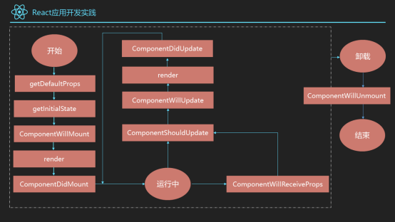
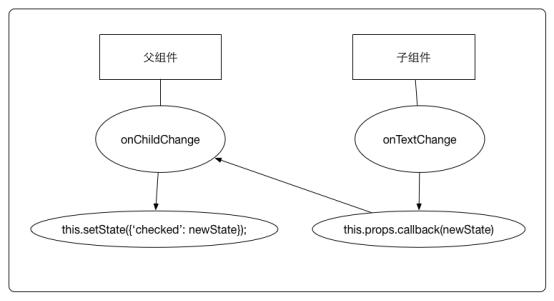

# Frontend Interview keypoints

   &nbsp &nbsp &nbsp &nbsp &nbsp

## React

### 1. 介绍一下react, react的好处

React 是一个用于构建用户界面的 JAVASCRIPT 库。React主要用于构建UI，很多人认为 React 是 MVC 中的 V（视图）

React特点有：

1.声明式设计 −React采用声明范式，可以轻松描述应用。

2.高效 −React通过对DOM的模拟，最大限度地减少与DOM的交互。

3.灵活 −React可以与已知的库或框架很好地配合。

4.JSX − JSX 是 JavaScript 语法的扩展。React 开发不一定使用 JSX ，但我们建议使用它。

5.组件 − 通过 React 构建组件，使得代码更加容易得到复用，能够很好的应用在大项目的开发中。

6.单向响应的数据流 − React 实现了单向响应的数据流，从而减少了重复代码，这也是它为什么比传统数据绑定更简单。

### 2. React单项数据流

在React中，数据是单向流动的，是从上向下的方向，即从父组件到子组件的方向。
state和props是其中重要的概念，如果顶层组件初始化props，那么React会向下遍历整颗组件树，重新渲染相关的子组件。

其中state表示的是每个组件中内部的的状态，这些状态只在组件内部改变。
把组件看成是一个函数，那么他接受props作为参数，内部由state作为函数的内部参数，返回一个虚拟dom的实现。

### 3. react生命周期函数和react组件的生命周期

React的组件在第一次挂在的时候首先获取父组件传递的props，接着获取初始的state值，接着经历挂载阶段的三个生命周期函数，也就是ComponentWillMount，render，ComponentDidMount，这三个函数分别代表组件将会挂载，组件渲染，组件挂载完毕三个阶段，在组件挂载完成后，组件的props和state的任意改变都会导致组建进入更新状态，在组件更新阶段，如果是props改变，则进入ComponentWillReceiveProps函数，接着进入ComponentShouldUpdate进行判断是否需要更新，如果是state改变则直接进入ComponentShouldUpdate判定，这个默认是true，当判定不需要更新的话，组件继续运行，需要更新的话则依次进入ComponentWillMount，render，ComponentDidMount三个函数，当组件卸载时，会首先进入生命周期函数ComponentWillUnmount,之后才进行卸载，如图

React的生命周期函数：

初始化阶段：getDefaultProps获取实例的默认属性，getInitialState获取每个实例的初始化状态，ComponentWillMount：组件将被装载，渲染到页面上，render：组件在这里生成虚拟的DOM节点，ComponentDidMount:组件真正被装载之后

运行中状态： componentWillReceiveProps:组件将要接收到属性的时候调用 shouldComponentUpdate:组件接受到新属性或者新状态的时候（可以返回 false，接收数据后不更新，阻止 render 调用，后面的函数不会被继续执行了）shouldComponentUpdate 这个方法用来判断是否需要调用 render 方法重新描绘 dom。因为 dom 的描绘非常消耗性能，如果我们能在 shouldComponentUpdate 方法中能够写出更优化的 dom diff 算法，可以极大的提高性能。 componentWillUpdate:组件即将更新不能修改属性和状态 render:组件重新描绘 componentDidUpdate:组件已经更新 销毁阶段： componentWillUnmount:组件即将销毁

初始化

1、getDefaultProps()

设置默认的props，也可以用dufaultProps设置组件的默认属性.

2、getInitialState()

在使用es6的class语法时是没有这个钩子函数的，可以直接在constructor中定义this.state。此时可以访问this.props

3、componentWillMount()

组件初始化时只调用，以后组件更新不调用，整个生命周期只调用一次，此时可以修改state。

4、 render()

react最重要的步骤，创建虚拟dom，进行diff算法，更新dom树都在此进行。此时就不能更改state了。

5、componentDidMount()

组件渲染之后调用，只调用一次。

更新

6、componentWillReceiveProps(nextProps)

组件初始化时不调用，组件接受新的props时调用。

7、shouldComponentUpdate(nextProps, nextState)

react性能优化非常重要的一环。组件接受新的state或者props时调用，我们可以设置在此对比前后两个props和state是否相同，如果相同则返回false阻止更新，因为相同的属性状态一定会生成相同的dom树，这样就不需要创造新的dom树和旧的dom树进行diff算法对比，节省大量性能，尤其是在dom结构复杂的时候

8、componentWillUpdata(nextProps, nextState)

组件初始化时不调用，只有在组件将要更新时才调用，此时可以修改state

9、render()

组件渲染

10、componentDidUpdate()

组件初始化时不调用，组件更新完成后调用，此时可以获取dom节点。

卸载

11、componentWillUnmount()

组件将要卸载时调用，一些事件监听和定时器需要在此时清除。

### 4. react和Vue的原理，区别，亮点，作用

我曾经看过vue作者尤雨溪的一个专访，他说过这样一段话(大概内容)：做框架的时候我们也很纠结，到底是定制内容少一点好还是定制内容多一点好。定制少了，很多人不知道一些情况应该怎么处理，所以他就乱来，写的代码乱七八糟，性能也不好，然后他就会认为你的框架没做好，有的人还去网上喷你。但是当大家经验越来越丰富，反而希望受到框架的限制越少越好。因为随着经验的增加，大家都知道了各种场景下应该怎么处理，优化自己的代码。限制越少，自我发挥的空间就越大。
最终我们可以看到，纠结之后，vue的选择居于react与angular之间，框架自身的语法比react多一点，但是又比angular少一点。

也正是由于选择的不同，所呈现出来的写法与思考方式就一定会有所差异，不论优劣，但肯定会导致不同的偏好。

react的简单在于，它的核心API其实非常少。所以我们会看到很多地方在说react其实是一个UI库，并不是一个完整的框架。他只是告诉我们如何创建组件以及组件之间如何进行数据传递。甚至于创建组件的方式正是使用ES6的class语法(createClass将会在react 16被丢弃)。

因此开发中react的使用对于ES6的语法依赖非常高。因为react自身本来就没有多少强限制的语法。我们只需要掌握组件里的props，state，ref，生命周期，就好像没有过多额外的知识了。就连如果想要在jsx模板来遍历渲染，还得使用原生的map方法。而react的高阶组件，理解之后发现，其实就是JavaScript函数式编程中所涉及到的思维方式。

所以在我看来，react的最大特点就是简单并且与原生JavaScript非常接近。即给开发者带来的束缚非常少。一个功能的实现，如果你知道使用原生JavaScript如何实现，那么你就一定能够很轻松的知道使用react如何实现。

当然，核心API简单并不代表上手容易。在使用之初，如果你经验缺乏，那么你用react写出来的页面，性能可能会非常差。因为无意识的，你的组件可能会有非常多的多余的渲染。

比如很多人在学习react的时候，会接触到一个倒计时的例子，这个例子使用修改组件中state的方式来实现。但是其实后来大家会慢慢知道，这种方式是非常错误的。因为state的每次修改，都会导致组件及其所有子组件的重新渲染。这是成本非常高的行为。当然，我还知道很多人，在调试react的时候，由于高频的重复渲染直接把浏览器都卡死的。这些问题都是尤雨溪所担心的限制过少带来的。

网上有的自以为牛逼的人，用着react/vue这样的框架，其实写着很烂的代码，恐怖的是他们还嘲讽这嘲讽那的。还遇到过一个人，口口声声说自己用了angular好多年，说angular真的好垃圾啊，性能好差啊，什么什么的各种黑，结果连track by都不会用。而react由于没有真正意义上的双向绑定。因此在处理一些复杂场景会非常麻烦，比如复杂的表单验证。

而相对而言，vue提供的能力则更多一点，这些便捷的能力会让初学者感觉到非常的幸福，因为很多效果只需要一些简单的代码既可以实现。我大概列举几条我个人认为非常棒的能力：

统一管理的计算属性

### 5. reactJs的组件交流

React组件之间的交流方式可以分为以下三种

1、父组件向子组件传值:主要是利用props来进行交流

2、子组件向父组件传值：子组件通过控制自己的state然后告诉父组件的点击状态。然后在父组件中展示出来，如图：

3、没有任何嵌套关系的组件之间传值：如果组件之间没有任何关系，组件嵌套层次比较深（个人认为 2 层以上已经算深了），或者你为了一些组件能够订阅、写入一些信号，不想让组件之间插入一个组件，让两个组件处于独立的关系。对于事件系统，这里有 2 个基本操作步骤：订阅（subscribe）/监听（listen）一个事件通知，并发送（send）/触发（trigger）/发布（publish）/发送（dispatch）一个事件通知那些想要的组件。

### 6. 有了解过react的虚拟DOM吗，虚拟DOM是怎么对比的呢

当然是使用的diff算法，diff算法有三种优化形式：

tree diff：将新旧两颗DOM树按照层级遍历，只对同级的DOM节点进行比较，即同一父节点下的所有子节点，当发现节点已经不存在，则该节点及其子节点会被完全删除，不会进一步比较

component diff：不同组件之间的对比，如果组件类型相同，暂不更新，否则删除旧的组件，再创建一个新的组件，插入到删除组件的位置

element diff:在类型相同的组件内，再继续对比组件内部的元素

### 7. 怎么获取真正的dom

ReactDOM.findDOMNode()或this.refs

### 8. setState之后的流程

在代码中调用setState函数之后，React 会将传入的参数对象与组件当前的状态合并，然后触发所谓的调和过程（Reconciliation）。 经过调和过程，React 会以相对高效的方式根据新的状态构建 React 元素树并且着手重新渲染整个UI界面。 在 React 得到元素树之后，React 会自动计算出新的树与老树的节点差异，然后根据差异对界面进行最小化重渲染。 在差异计算算法中，React 能够相对精确地知道哪些位置发生了改变以及应该如何改变，这就保证了按需更新，而不是全部重新渲染。

### 9. react高阶组件知道吗？

高阶组件接收React组件作为参数，并且返回一个新的React组件。高阶组件本质上也是一个函数，并不是一个组件。

### 10. react的组件是通过什么去判断是否刷新的

通过state是否改变

