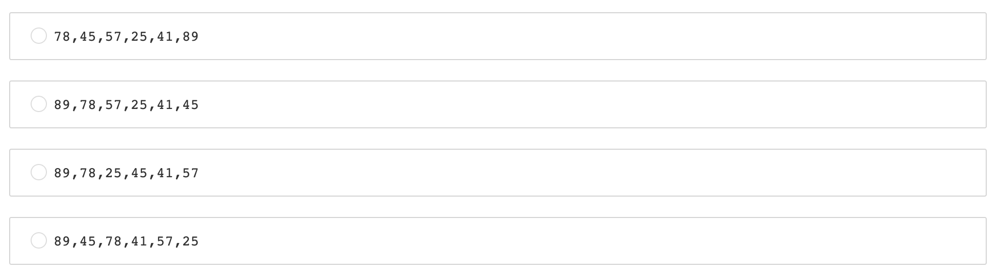
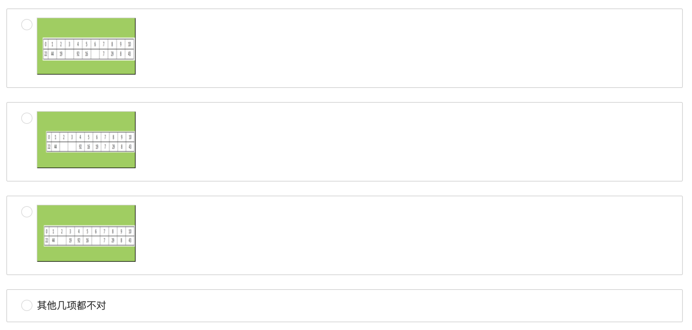
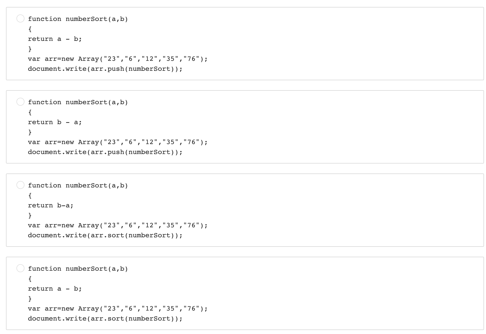
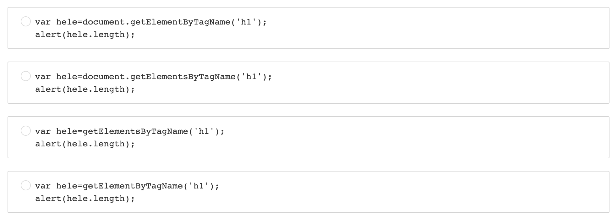
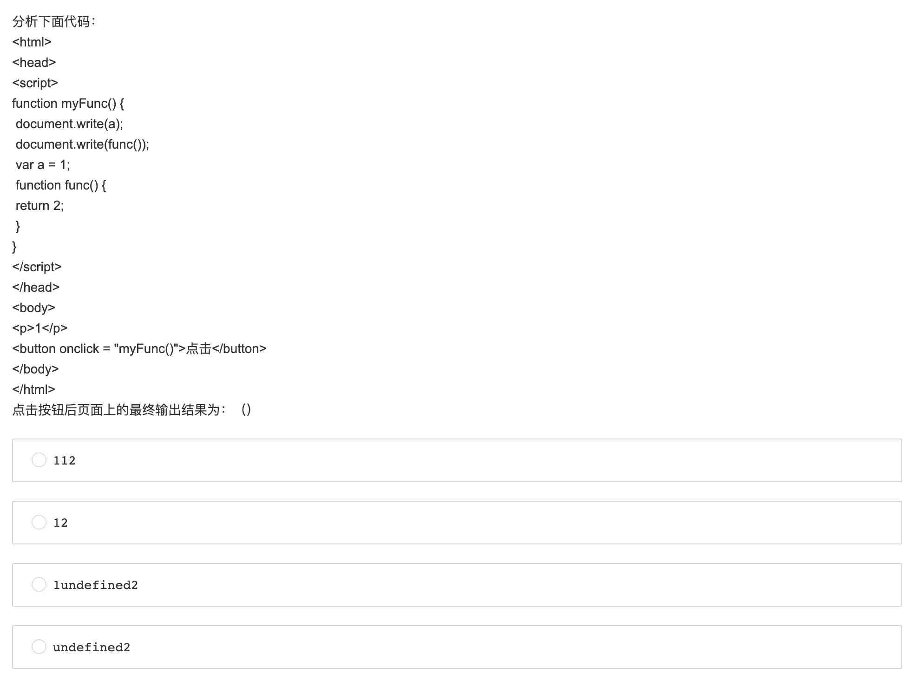
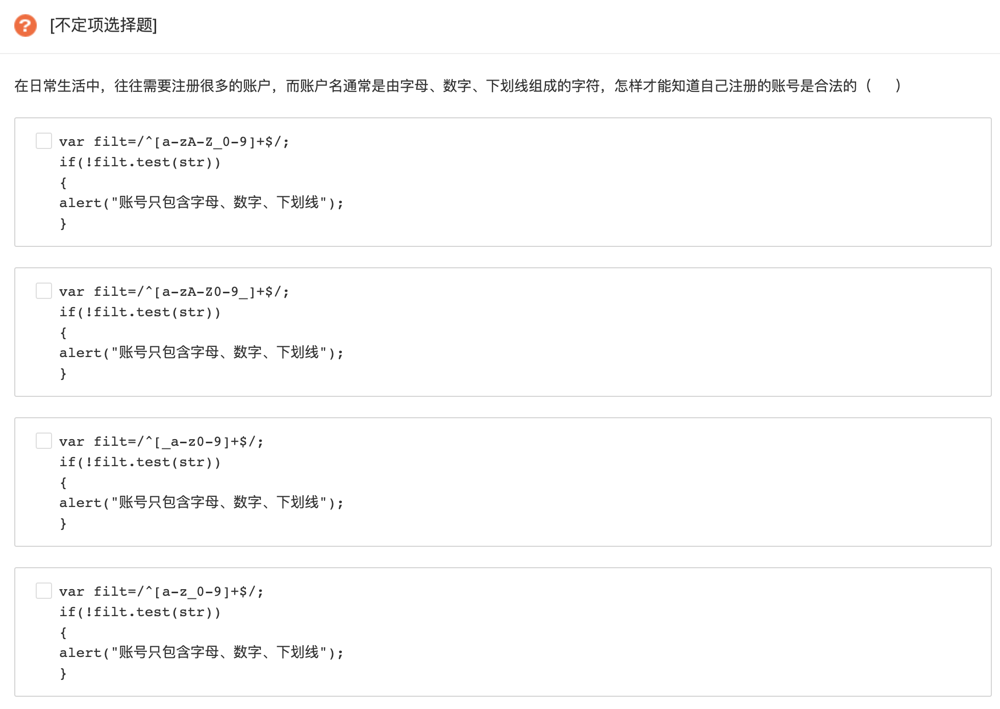
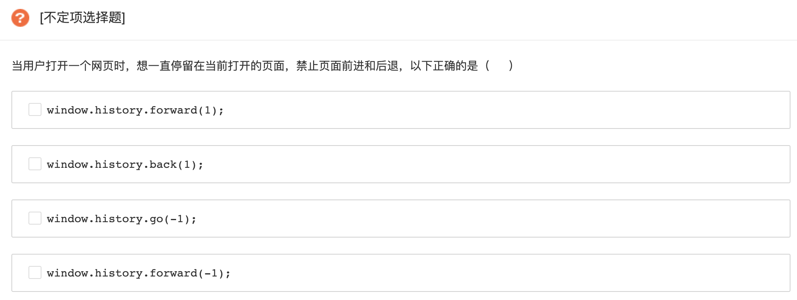
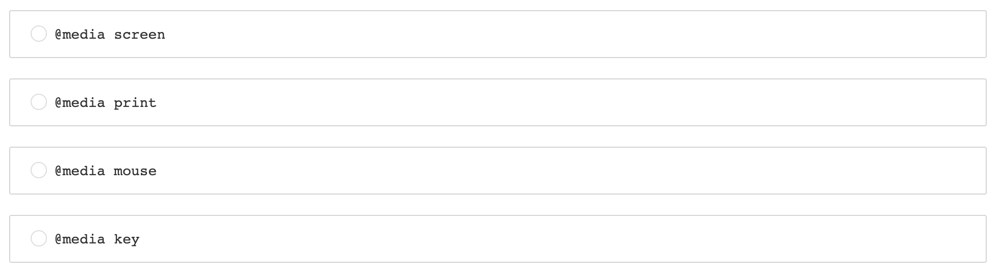
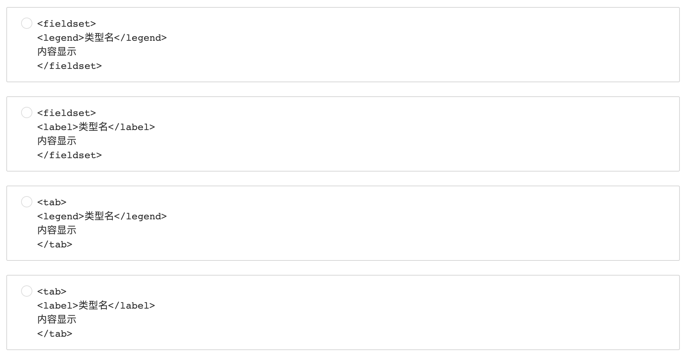

# Frontend 秋招 笔试

   &nbsp &nbsp &nbsp &nbsp &nbsp

## 爱奇艺2019秋招前端开发方向笔试题（A）

### Q1. 

[单选题]

使用堆排序方法排序（45，78，57，25，41，89），初始堆为（      ）

### Q2. 

[单选题]

6个圆盘的汉诺塔，总的移动次数是（      ）

A. 30

B. 33

C. 60

D. 63

### Q3. 

[单选题]

设哈希表长为11，哈希函数为Hash (key)=key%11。存在关键码{43,7,29,22,16,92,44,8,19}，采用二次探测法处理冲突，建立的hash表为（    ）

### Q4.

[不定项选择题]

有关希尔排序算法叙述正确的是（      ）

A. 最后一次的步长增量一定为1

B. 分割后子序列内部的排序算法是直接插入排序

C. 分割后子序列内部的排序算法是直接选择排序

D. 希尔排序是稳定排序算法

### Q5. 

[单选题]

广义表K=(m,n,(p,(q,s)),(h,f)),则head[tail[head[tail[tail(K)]]]]的值为（      ）

A. s

B. q

C. p

D. h

### Q6. 

[单选题]

在一个空的5阶B-树中依次插入关键字序列{6,8,15,16,22,10,18,32,20}，插入完成后，关键字6所在结点包含的关键字个数为（      ）

A. 2

B. 3

C. 4

D. 5

### Q7. 

[不定项选择题]

在求两个集合并集的过程中，可能需用到的操作是（      ）

A. 取元素

B. 插入元素

C. 比较操作

D. 求表长

### Q8. 

[不定项选择题]

TCP协议与UDP协议负责端到端连接，下列那些信息只出现在TCP报文，UDP报文不包含此信息（      ）

A. 序列号

B. 源端口

C. 目标端口

D. 窗口大小

### Q9. 

[不定项选择题]

程序员编写程序时使用文件系统提供的系统调用将内存中由address地址开始的n个字节或n个记录的信息写入指定文件中，但发现文件名不可用，可行的解决办法是（）

A. 使用文件描述符代替文件名

B. 使用文件句柄代替文件名

C. 使用当前进程的PCB编号代替

D. 以上方法都不可行

### Q10. 

[单选题]

某软件公司正在升级一套水务管理系统。该系统用于县市级供排水企业、供水厂、排水厂中水务数据的管理工作。系统经重新整合后，开发人员决定不再使用一张备份数据表waterinfo001表，需永久删除。选出符合要求的语句。 

A. DELETE TABLE waterinfo001

B. DELETE FROM TABLE waterinfo001

C. DROP TABLE waterinfo001

D. DROP FROM TABLE waterinfo001

### Q11.

[单选题]

在JavaScript中，调用对象属性的描述中，以下代码错误的是（      ）例如：调用对象obj的arr属性。

A. obj["arr"]

B. obj["a"+"t"+"t"]

C. obj{"arr"}

D. obj.arr

### Q12.

[单选题]

现有一组人员年龄的数据，要求将这些人员的年龄按照从小到大的顺序进行排列起来，要怎样来实现（      ）

 
### Q13.

[单选题]

在开发中，通常都是使用h标签来定义文本中的标题，若想要知道文本中共有多少个标题主题文档，该如何实现（      ）

### Q14.

[单选题]

### Q15.

[不定项选择题]

### Q16.

[不定项选择题]

### Q17.

[单选题]

设置不同屏幕中，元素的位置不会发生改变的是（      ）

### Q18.

[单选题]

在做一份调查报告时，要求将问题文类，同一表单内的数据在一组显示，并表明此类型的名称，如何将相同类型的表单进行分组（      ）

### Q19.

[单选题]

实现翻书的效果可以使用css3里的什么方法

A. rotateY

B. translateY

C. sacleY

D. perspective(n）

### Q20.

[单选题]

下列哪种选择器不是css3才定义的

A. :enabled

B. :checked

C. :before

D. :only-child

