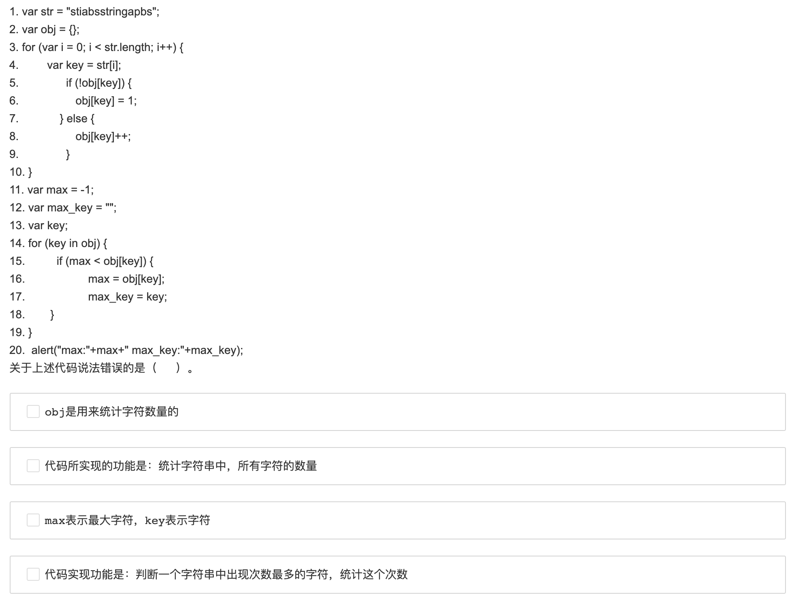

# Frontend 秋招 笔试

   &nbsp &nbsp &nbsp &nbsp &nbsp

## 爱奇艺2019秋招前端开发方向笔试题（B）

### Q1. 

[单选题]

某学生信息表，设一组表示成绩的关键字序列(24,15,32,28,19,10,40)采用直接插入排序时，当插入记录19到有序表时，为找插入位置需比较次数为（      ）

A. 2

B. 3

C. 4

D. 5

### Q2. 

[单选题]

A、B、C、D、E、F依次入栈，其出栈顺序为B、D、C、F、E、A，则该栈最小容量为（      ）

A. 6

B. 5

C. 4

D. 3

### Q3. 

[单选题]

设哈希表长为11，哈希函数为Hash (key)=key%11。存在关键码{7,29,22,16,92,44,8,19}，采用线性探测法处理冲突，建立的hash表为（    ）

### Q4.

[不定项选择题]

下列哪些算法在排序过程中需要一个记录的辅助空间（      ）

A. 直接选择排序

B. 直接插入排序

C. 冒泡排序

D. 归并排序

### Q5.

[单选题]

假设在有序线性表A[1..30]上进行二分查找,则比较五次查找成功的结点数为（      ） 

A. 8

B. 12

C. 15

D. 16

### Q6.

[单选题]

已知一个由5个顶点8条边构成的有向图，以下说法正确的是（      ）

### Q7.

[不定项选择题]

已知二叉树A(B(,D(F,H)),C(,E(G(I)))),由此二叉树转换的森林描述正确的是（      ）

### Q8.

[不定项选择题]

internet骨干网中的路由器通过BGP协议传输数据,BGP协议使用传输层的协议与端口有（      ）

A. UDP协议

B. TCP协议

C. 端口179

D. 端口169

### Q9.

[不定项选择题]

OS在进行磁盘调度时，要考虑选择合适的算法。此时有6个请求者请求访问磁盘。1号请求者要访问9号柱面6号磁头3号扇区；2号请求者要访问7号柱面5号磁头6号扇区；3号请求者要访问15号柱面20号磁头6号扇区；4号请求者要访问9号柱面4号磁头4号扇区；5号请求者要访问20号柱面9号磁头5号扇区；6号请求者要访问7号柱面15号磁头2号扇区。假设此时磁头位于8号柱面，那么最省时间的响应次序为（）

A. 146235

B. 241356

C. 621435

D. 352614

### Q10.

[单选题]

某学院包含多个专业如计算机科学、信息管理、软件工程、网络工程。每个专业每年都招收一个班级的学生。在招生过程中就已明确规定，一个学生只能就读于该学院的一个班级，但是一个班级可以招收不超过60个学生。那么，学生和班级之间是________的关系。

A. 一对多

B. 多对多

C. 一对一

D. 多对一

### Q11.

[单选题]

当在手机中需要保存移动手机号码时，怎样才能知道输入的手机号就是11位的移动手机号（      ）

### Q12.

[单选题]

用户在登陆某个账号时，通常是将账号名和密码分别输入到对应的文本框中，现要将账号名和密码连接起来作为用户的唯一标识符，怎样来实现这一功能（      ）

### Q13.

[单选题]

### Q14.

[单选题]

### Q15.

[不定项选择题]

在开发中，往往需要从后台调用一些数据在前端显示，如何在前端显示一组无序的数据（      ）

### Q16.

[不定项选择题]

### Q17.

[单选题]

通常我们需要获取某个信息时，都会通过几个缩写的关键字进行检索，那么，在开发中，如何使用Html5元素进行布局（      ）

A. abbr

B. search

C. key

D. bdo

### Q18.

[单选题]

HTML 语言中，设置表格中文字与边框距离的标签是（      ）

### Q19.

[单选题]

使用什么可以实现css3动画效果

A. keyframes

B. transition

C. transform

D. rotate3d

### Q20.

[单选题]

css优先级顺序正确的是

